# Luồng ứng dụng AI Parking

Tài liệu này mô tả chi tiết các luồng ứng dụng AI Parking, từ khi người dùng mở ứng dụng đến khi hoàn thành các tác vụ chính.

## 1. Luồng người dùng cuối (End User)

### 1.1. Đăng ký và đăng nhập

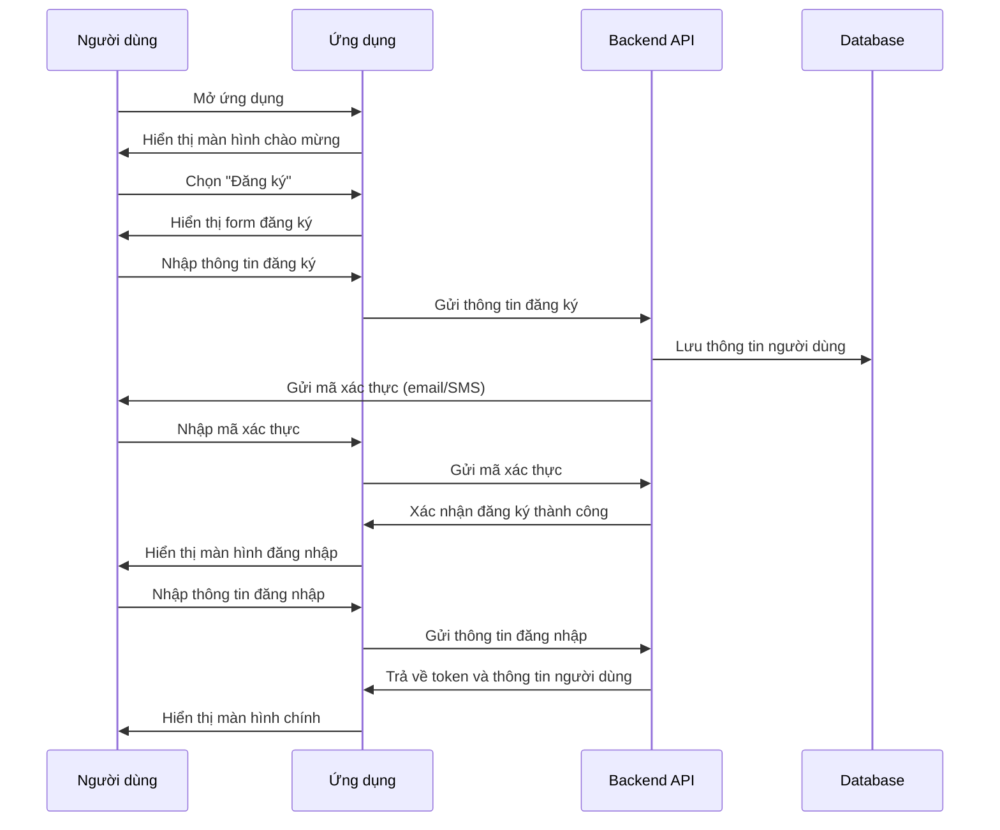

### 1.2. Tìm kiếm và đặt chỗ đỗ xe

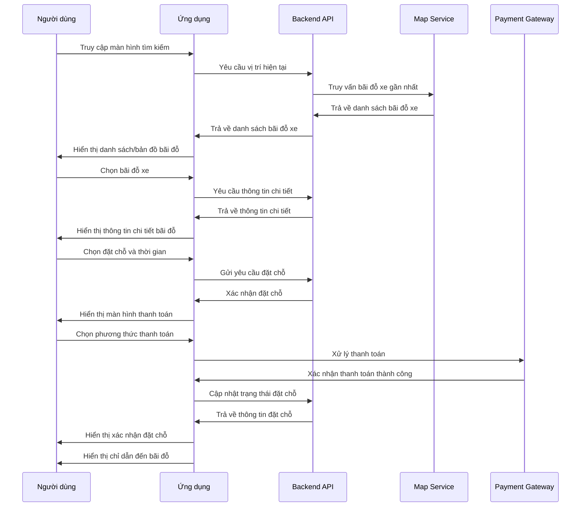

### 1.3. Sử dụng bãi đỗ xe

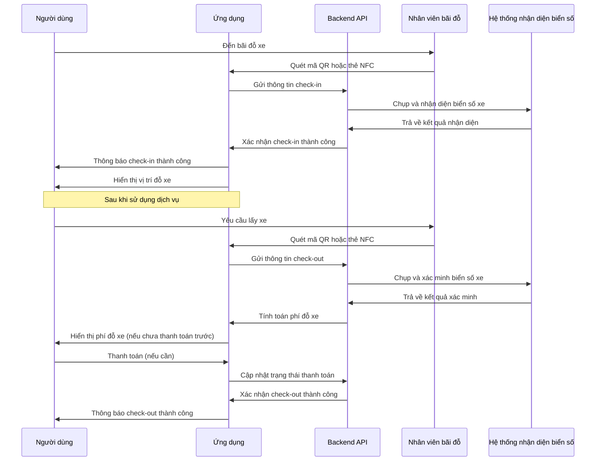

### 1.4. Đánh giá và phản hồi

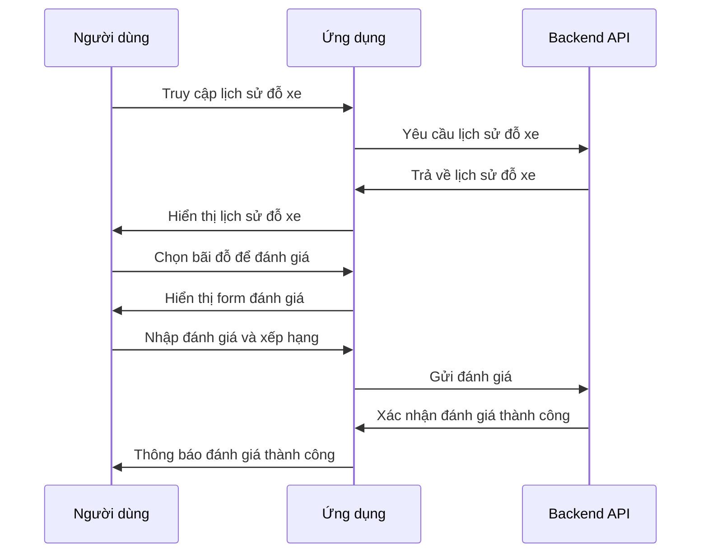

## 2. Luồng chủ bãi đỗ xe (Parking Owner)

### 2.1. Thiết lập bãi đỗ xe

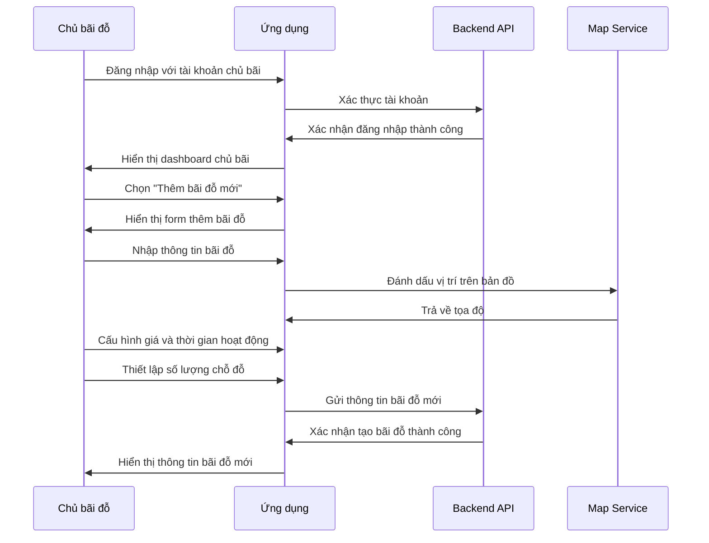

### 2.2. Quản lý bãi đỗ xe

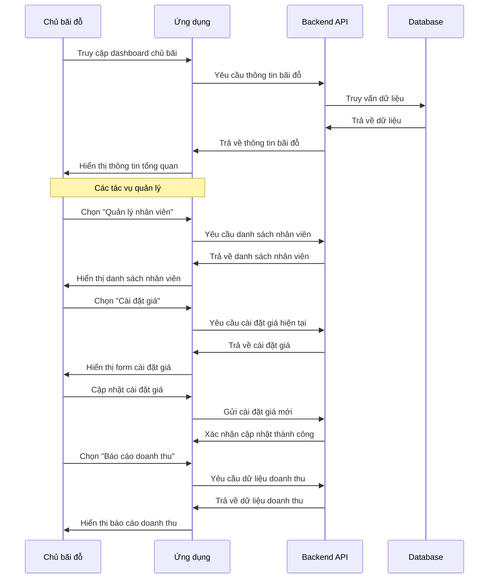

### 2.3. Quản lý license

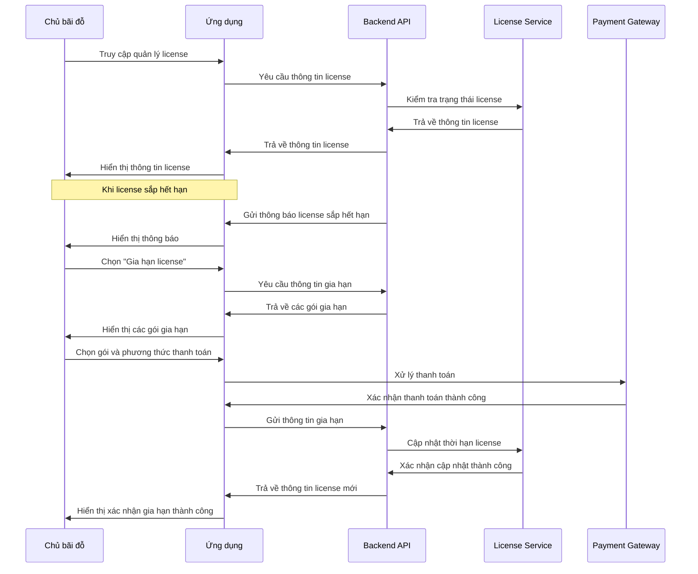

## 3. Luồng nhân viên bãi đỗ xe (Parking Staff)

### 3.1. Quản lý xe ra/vào

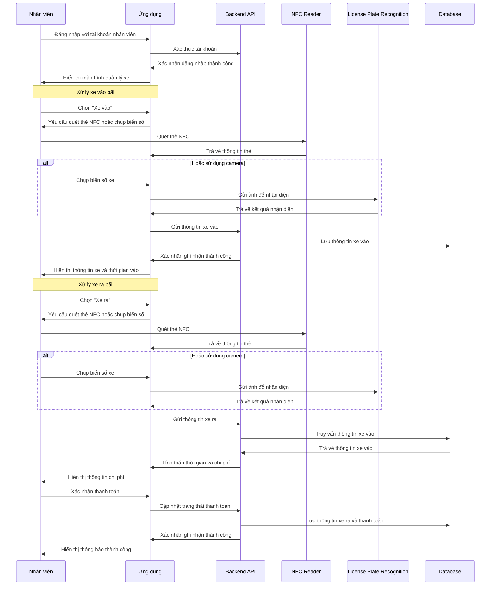

### 3.2. Hoạt động offline

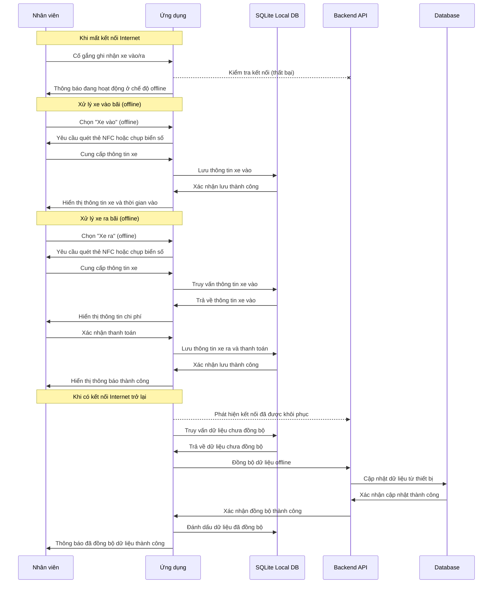

## 4. Luồng quản lý bãi đỗ xe (Parking Manager)

### 4.1. Giám sát bãi đỗ xe

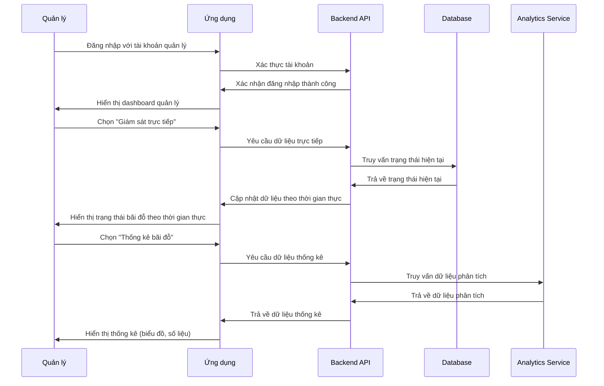

### 4.2. Nhận thông báo

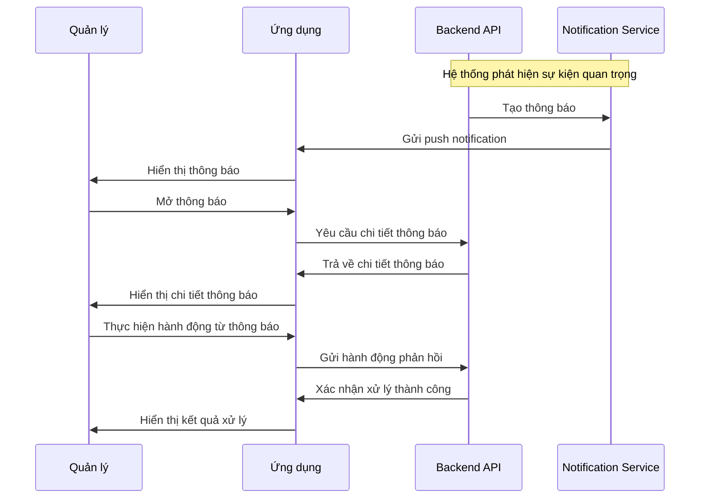

## 5. Luồng chung

### 5.1. Đồng bộ hóa dữ liệu offline

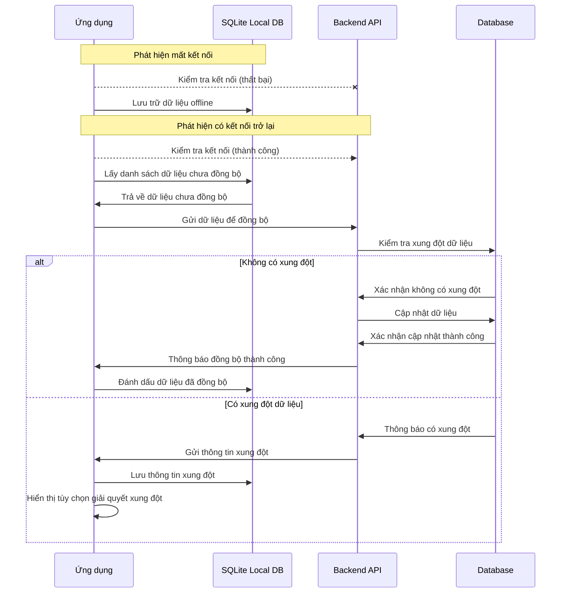

### 5.2. Quản lý license

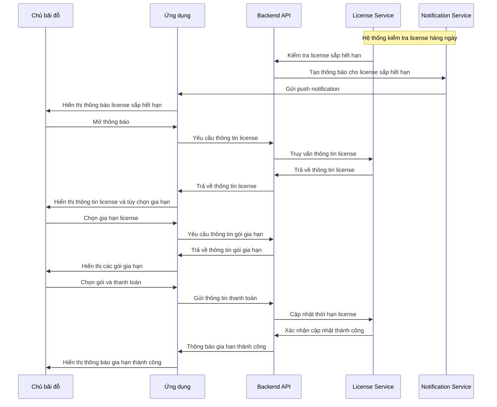

## Kết luận

Các luồng ứng dụng được thiết kế để cung cấp trải nghiệm người dùng mượt mà và liền mạch, đồng thời đảm bảo hệ thống hoạt động hiệu quả ngay cả khi mất kết nối internet. Luồng ứng dụng được tối ưu hóa cho từng đối tượng người dùng khác nhau, đảm bảo đáp ứng đầy đủ các yêu cầu chức năng của dự án AI Parking.

---
*Cập nhật: Đã bổ sung các luồng mới liên quan đến quét thẻ NFC, xử lý nhận diện biển số xe offline, đồng bộ hóa dữ liệu khi có kết nối trở lại, quản lý và gia hạn license.*
