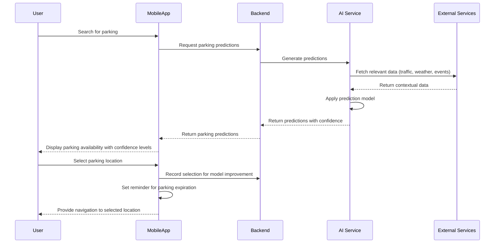
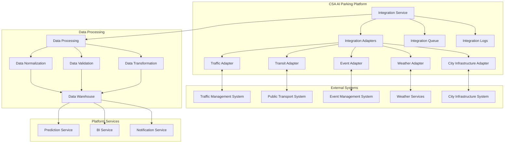
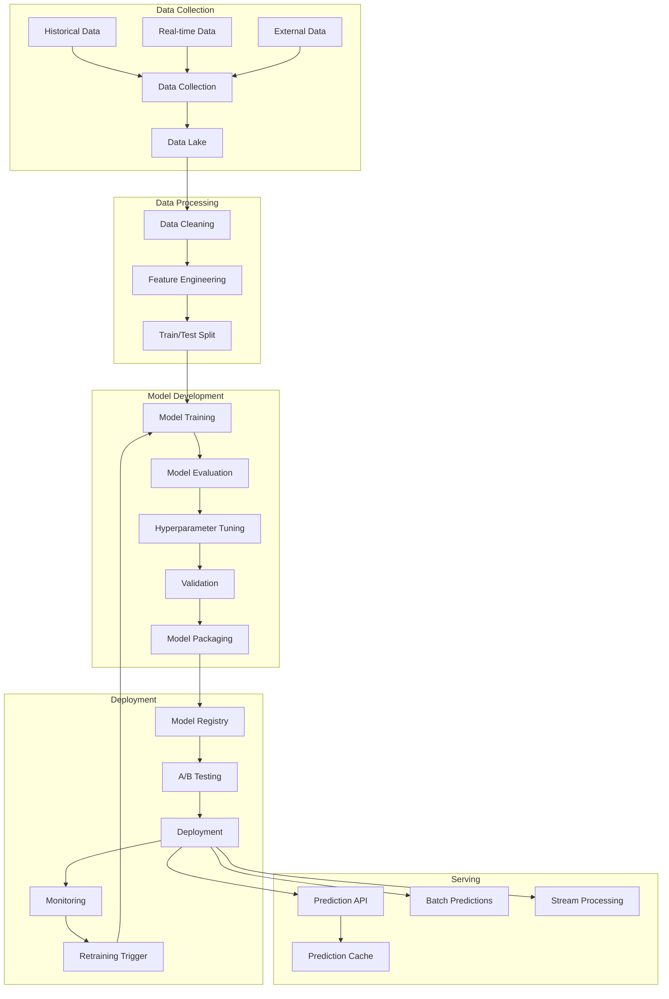
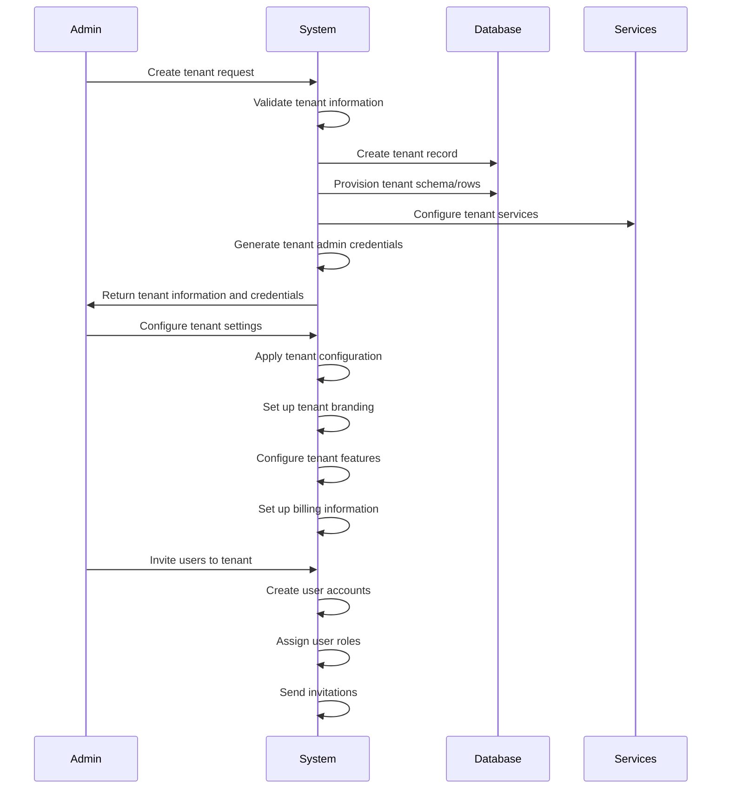
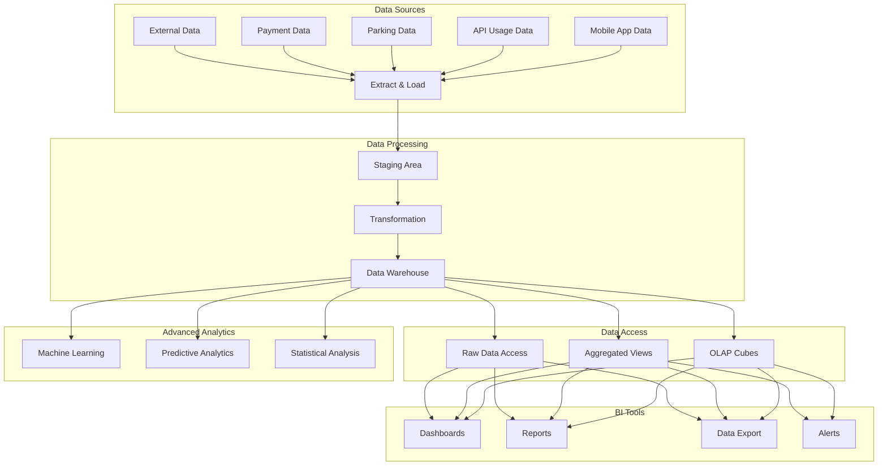
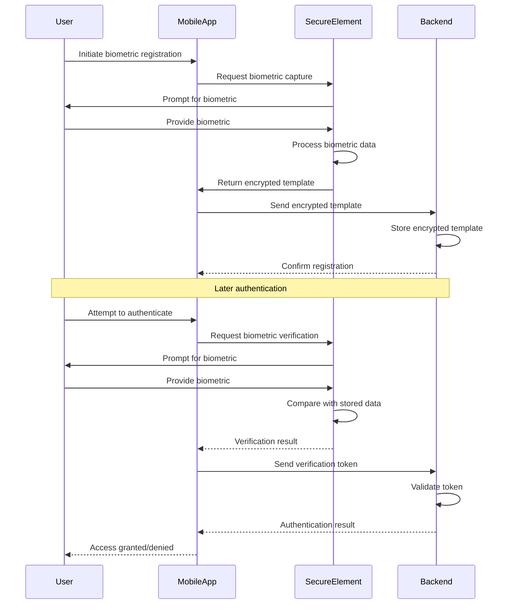
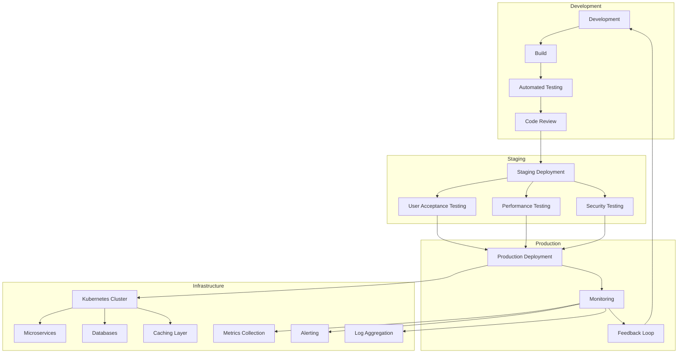

# Phase 3 Design Document

## 1. Introduction

This document outlines the detailed design for Phase 3 of the CSA AI Parking project. Building upon the foundation established in Phases 1 and 2, Phase 3 focuses on transforming the platform into a comprehensive smart mobility solution with advanced integrations, predictive capabilities, and enterprise-grade features.

## 2. Phase 3 Scope

Phase 3 encompasses the following key advancements:

- Smart city integrations and partnerships
- Predictive parking availability system
- Comprehensive payment ecosystem
- Advanced security with biometric authentication
- Multi-tenancy for enterprise customers
- Advanced business intelligence
- Developer platform with APIs and SDKs

## 3. Architecture Updates

### 3.1 System Architecture Diagram

```mermaid
graph TD
    subgraph "Mobile & Client Applications"
        MA[Mobile App] --> MAPRED[Predictive Module]
        MA --> MABIO[Biometric Auth]
        MA --> MAPAY[Enhanced Payment]
        MA --> MAAPI[SDK Access]
        
        WEB[Web Application] --> WEBADMIN[Admin Dashboard]
        WEB --> WEBAPI[API Console]
        WEB --> WEBBI[BI Dashboard]
        
        SDK[Developer SDK] --> SDKAUTH[Auth Module]
        SDK --> SDKAPI[API Access]
        SDK --> SDKDOCS[Documentation]
    end
    
    subgraph "API Gateway & Management"
        APIG[API Gateway] --> APIM[API Management]
        APIM --> APIRATE[Rate Limiting]
        APIM --> APIMON[API Monitoring]
        APIM --> APIANALYTICS[API Analytics]
        
        APIG --> AUTH[Auth Service]
        APIG --> TENANTMGR[Tenant Manager]
    end
    
    subgraph "Core Services"
        TENANTMGR --> PARK[Parking Service]
        TENANTMGR --> PAYMENT[Payment Service]
        TENANTMGR --> LICENSE[License Service]
        TENANTMGR --> VEHICLE[Vehicle Service]
        TENANTMGR --> PREDICT[Prediction Service]
        TENANTMGR --> INTEG[Integration Service]
        TENANTMGR --> BI[BI Service]
        
        PARK --> DB[(Database)]
        PAYMENT --> DB
        LICENSE --> DB
        VEHICLE --> DB
        PREDICT --> DB
        INTEG --> DB
        BI --> DB
        
        PREDICT --> CACHE[(Redis Cache)]
        INTEG --> CACHE
        BI --> CACHE
    end
    
    subgraph "AI & Analytics Platform"
        AIAPI[AI API] --> ANPR[ANPR Engine]
        AIAPI --> VCLASS[Vehicle Classification]
        AIAPI --> DEMAND[Demand Forecasting]
        AIAPI --> PRED[Predictive Analytics]
        AIAPI --> FRAUD[Fraud Detection]
        AIAPI --> ANOM[Anomaly Detection]
        
        PRED --> AIDB[(AI Model DB)]
        ANPR --> AIDB
        VCLASS --> AIDB
        DEMAND --> AIDB
        FRAUD --> AIDB
        ANOM --> AIDB
        
        BI --> PRED
    end
    
    subgraph "External Integrations"
        INTEG --> SMARTCITY[Smart City APIs]
        INTEG --> PAYPROVIDERS[Payment Providers]
        INTEG --> MAPS[Map Services]
        INTEG --> TRAFFIC[Traffic Services]
        INTEG --> WEATHER[Weather Services]
        INTEG --> EVENTS[Event APIs]
    end
    
    MA <--> APIG
    WEB <--> APIG
    SDK <--> APIG
    AIAPI <--> PREDICT
    AIAPI <--> BI
```



### 3.2 Architectural Changes

1. **Multi-Tenant Architecture**:
   - Tenant isolation at service and database levels
   - Tenant-specific configuration and customization
   - Tenant management and provisioning services

2. **API Gateway & Management**:
   - Enhanced API gateway with advanced routing
   - API management layer for rate limiting and monitoring
   - Developer portal for API access management
   - API analytics and usage reporting

3. **Smart City Integrations**:
   - Integration service for external city systems
   - Standardized adapters for various smart city platforms
   - Real-time data exchange protocols
   - Event-based communication system

4. **Advanced AI Platform**:
   - Expanded AI infrastructure with model versioning
   - Predictive analytics engine
   - Anomaly and fraud detection systems
   - Enhanced model training pipeline

5. **Business Intelligence Platform**:
   - Data warehouse for analytics
   - Real-time dashboards and reporting
   - Custom report generation
   - Data export capabilities

## 4. Database Schema Updates

### 4.1 New Tables

```sql
-- Multi-tenancy tables
CREATE TABLE tenants (
    id UUID PRIMARY KEY,
    name VARCHAR(100) NOT NULL,
    domain VARCHAR(255) UNIQUE,
    status VARCHAR(20) NOT NULL,
    configuration JSONB,
    created_at TIMESTAMP WITH TIME ZONE DEFAULT NOW(),
    updated_at TIMESTAMP WITH TIME ZONE DEFAULT NOW()
);

CREATE TABLE tenant_users (
    id UUID PRIMARY KEY,
    tenant_id UUID NOT NULL REFERENCES tenants(id),
    user_id UUID NOT NULL REFERENCES users(id),
    role VARCHAR(50) NOT NULL,
    created_at TIMESTAMP WITH TIME ZONE DEFAULT NOW(),
    updated_at TIMESTAMP WITH TIME ZONE DEFAULT NOW(),
    UNIQUE(tenant_id, user_id)
);

-- Predictive parking tables
CREATE TABLE parking_predictions (
    id UUID PRIMARY KEY,
    location_id UUID NOT NULL REFERENCES parking_locations(id),
    prediction_time TIMESTAMP WITH TIME ZONE NOT NULL,
    occupancy_percentage DECIMAL(5,2) NOT NULL,
    confidence_score DECIMAL(5,2) NOT NULL,
    factors JSONB,
    created_at TIMESTAMP WITH TIME ZONE DEFAULT NOW(),
    updated_at TIMESTAMP WITH TIME ZONE DEFAULT NOW()
);

CREATE TABLE prediction_factors (
    id UUID PRIMARY KEY,
    name VARCHAR(100) NOT NULL,
    description TEXT,
    weight DECIMAL(5,2),
    active BOOLEAN DEFAULT TRUE,
    created_at TIMESTAMP WITH TIME ZONE DEFAULT NOW(),
    updated_at TIMESTAMP WITH TIME ZONE DEFAULT NOW()
);

CREATE TABLE location_historical_data (
    id UUID PRIMARY KEY,
    location_id UUID NOT NULL REFERENCES parking_locations(id),
    timestamp TIMESTAMP WITH TIME ZONE NOT NULL,
    occupancy_percentage DECIMAL(5,2) NOT NULL,
    weather_conditions JSONB,
    events_nearby JSONB,
    traffic_conditions JSONB,
    created_at TIMESTAMP WITH TIME ZONE DEFAULT NOW()
);

-- Developer platform tables
CREATE TABLE api_keys (
    id UUID PRIMARY KEY,
    tenant_id UUID REFERENCES tenants(id),
    user_id UUID REFERENCES users(id),
    key_name VARCHAR(100) NOT NULL,
    api_key VARCHAR(100) UNIQUE NOT NULL,
    scopes JSONB NOT NULL,
    rate_limit INTEGER NOT NULL,
    status VARCHAR(20) NOT NULL,
    expires_at TIMESTAMP WITH TIME ZONE,
    created_at TIMESTAMP WITH TIME ZONE DEFAULT NOW(),
    updated_at TIMESTAMP WITH TIME ZONE DEFAULT NOW()
);

CREATE TABLE api_usage_logs (
    id UUID PRIMARY KEY,
    api_key_id UUID REFERENCES api_keys(id),
    endpoint VARCHAR(255) NOT NULL,
    method VARCHAR(10) NOT NULL,
    status_code INTEGER NOT NULL,
    response_time INTEGER NOT NULL,
    request_size INTEGER,
    response_size INTEGER,
    ip_address VARCHAR(45),
    user_agent TEXT,
    timestamp TIMESTAMP WITH TIME ZONE NOT NULL,
    created_at TIMESTAMP WITH TIME ZONE DEFAULT NOW()
);

-- Smart city integration tables
CREATE TABLE integration_providers (
    id UUID PRIMARY KEY,
    name VARCHAR(100) NOT NULL,
    provider_type VARCHAR(50) NOT NULL,
    configuration JSONB,
    status VARCHAR(20) NOT NULL,
    created_at TIMESTAMP WITH TIME ZONE DEFAULT NOW(),
    updated_at TIMESTAMP WITH TIME ZONE DEFAULT NOW()
);

CREATE TABLE integration_connections (
    id UUID PRIMARY KEY,
    tenant_id UUID REFERENCES tenants(id),
    provider_id UUID NOT NULL REFERENCES integration_providers(id),
    credentials JSONB,
    configuration JSONB,
    status VARCHAR(20) NOT NULL,
    created_at TIMESTAMP WITH TIME ZONE DEFAULT NOW(),
    updated_at TIMESTAMP WITH TIME ZONE DEFAULT NOW()
);

CREATE TABLE integration_events (
    id UUID PRIMARY KEY,
    connection_id UUID NOT NULL REFERENCES integration_connections(id),
    event_type VARCHAR(100) NOT NULL,
    event_data JSONB NOT NULL,
    processed BOOLEAN DEFAULT FALSE,
    processing_result JSONB,
    timestamp TIMESTAMP WITH TIME ZONE NOT NULL,
    created_at TIMESTAMP WITH TIME ZONE DEFAULT NOW(),
    updated_at TIMESTAMP WITH TIME ZONE DEFAULT NOW()
);

-- Enhanced security tables
CREATE TABLE biometric_credentials (
    id UUID PRIMARY KEY,
    user_id UUID NOT NULL REFERENCES users(id),
    biometric_type VARCHAR(50) NOT NULL,
    biometric_data BYTEA NOT NULL,
    device_identifier VARCHAR(255) NOT NULL,
    status VARCHAR(20) NOT NULL,
    created_at TIMESTAMP WITH TIME ZONE DEFAULT NOW(),
    updated_at TIMESTAMP WITH TIME ZONE DEFAULT NOW(),
    UNIQUE(user_id, biometric_type, device_identifier)
);

CREATE TABLE security_audit_logs (
    id UUID PRIMARY KEY,
    tenant_id UUID REFERENCES tenants(id),
    user_id UUID REFERENCES users(id),
    event_type VARCHAR(100) NOT NULL,
    resource_type VARCHAR(100),
    resource_id UUID,
    action VARCHAR(50) NOT NULL,
    ip_address VARCHAR(45),
    user_agent TEXT,
    additional_data JSONB,
    timestamp TIMESTAMP WITH TIME ZONE NOT NULL,
    created_at TIMESTAMP WITH TIME ZONE DEFAULT NOW()
);
```

### 4.2 Schema Updates to Existing Tables

```sql
-- Update users table for multi-tenancy and enhanced security
ALTER TABLE users 
ADD COLUMN primary_tenant_id UUID REFERENCES tenants(id),
ADD COLUMN user_preferences JSONB,
ADD COLUMN security_settings JSONB,
ADD COLUMN last_security_update TIMESTAMP WITH TIME ZONE;

-- Update parking_locations table for predictions and smart city
ALTER TABLE parking_locations
ADD COLUMN prediction_enabled BOOLEAN DEFAULT FALSE,
ADD COLUMN smart_city_location_id VARCHAR(100),
ADD COLUMN external_data_sources JSONB,
ADD COLUMN tenant_id UUID REFERENCES tenants(id);

-- Update payments table for multi-provider support
ALTER TABLE payments
ADD COLUMN provider VARCHAR(50),
ADD COLUMN provider_transaction_id VARCHAR(100),
ADD COLUMN provider_data JSONB,
ADD COLUMN tenant_id UUID REFERENCES tenants(id);

-- Update vehicles table for enhanced classification
ALTER TABLE vehicles
ADD COLUMN is_electric BOOLEAN DEFAULT FALSE,
ADD COLUMN charging_compatible BOOLEAN DEFAULT FALSE,
ADD COLUMN environmental_category VARCHAR(20),
ADD COLUMN tenant_id UUID REFERENCES tenants(id);
```

## 5. API Endpoints

### 5.1 Developer Platform API

```http
# API Keys Management
POST   /api/v1/developer/keys             # Create API key
GET    /api/v1/developer/keys             # List API keys
GET    /api/v1/developer/keys/{id}        # Get API key details
PUT    /api/v1/developer/keys/{id}        # Update API key
DELETE /api/v1/developer/keys/{id}        # Delete API key
POST   /api/v1/developer/keys/{id}/regenerate # Regenerate API key

# API Usage and Analytics
GET    /api/v1/developer/usage            # Get API usage statistics
GET    /api/v1/developer/usage/endpoints  # Get usage by endpoint
GET    /api/v1/developer/usage/daily      # Get daily usage stats
GET    /api/v1/developer/usage/logs       # Get detailed usage logs
```

### 5.2 Tenant Management API

```http
# Tenant Management
POST   /api/v1/admin/tenants              # Create tenant
GET    /api/v1/admin/tenants              # List tenants
GET    /api/v1/admin/tenants/{id}         # Get tenant details
PUT    /api/v1/admin/tenants/{id}         # Update tenant
DELETE /api/v1/admin/tenants/{id}         # Delete tenant
POST   /api/v1/admin/tenants/{id}/activate # Activate tenant
POST   /api/v1/admin/tenants/{id}/deactivate # Deactivate tenant

# Tenant Users
POST   /api/v1/admin/tenants/{id}/users   # Add user to tenant
GET    /api/v1/admin/tenants/{id}/users   # List tenant users
DELETE /api/v1/admin/tenants/{id}/users/{userId} # Remove user from tenant
PUT    /api/v1/admin/tenants/{id}/users/{userId} # Update user role
```

### 5.3 Predictive Parking API

```http
# Parking Predictions
GET    /api/v1/predictions/locations/{id} # Get predictions for location
GET    /api/v1/predictions/areas/{areaId} # Get predictions for area
GET    /api/v1/predictions/user           # Get personalized predictions
POST   /api/v1/predictions/feedback       # Submit prediction feedback

# Prediction Configuration
GET    /api/v1/predictions/factors        # Get prediction factors
PUT    /api/v1/predictions/factors/{id}   # Update prediction factor
POST   /api/v1/predictions/factors        # Add prediction factor
DELETE /api/v1/predictions/factors/{id}   # Delete prediction factor
```

### 5.4 Smart City Integration API

```http
# Integration Management
GET    /api/v1/integrations/providers     # List integration providers
GET    /api/v1/integrations/connections   # List active connections
POST   /api/v1/integrations/connections   # Create integration connection
PUT    /api/v1/integrations/connections/{id} # Update connection
DELETE /api/v1/integrations/connections/{id} # Delete connection
POST   /api/v1/integrations/connections/{id}/test # Test connection

# External Data
GET    /api/v1/integrations/events        # Get integration events
GET    /api/v1/integrations/data/traffic  # Get traffic data
GET    /api/v1/integrations/data/weather  # Get weather data
GET    /api/v1/integrations/data/events   # Get local events
```

### 5.5 Business Intelligence API

```http
# Reporting
GET    /api/v1/reports/templates          # Get report templates
POST   /api/v1/reports/generate           # Generate custom report
GET    /api/v1/reports/scheduled          # Get scheduled reports
POST   /api/v1/reports/scheduled          # Create scheduled report

# Dashboards
GET    /api/v1/dashboards                 # Get dashboards
GET    /api/v1/dashboards/{id}            # Get dashboard details
POST   /api/v1/dashboards                 # Create dashboard
PUT    /api/v1/dashboards/{id}            # Update dashboard
GET    /api/v1/dashboards/{id}/data       # Get dashboard data
```

### 5.6 Enhanced Security API

```http
# Biometric Authentication
POST   /api/v1/auth/biometric/register    # Register biometric
GET    /api/v1/auth/biometric/methods     # Get available biometric methods
DELETE /api/v1/auth/biometric/{id}        # Remove biometric
POST   /api/v1/auth/biometric/verify      # Verify biometric

# Security Audit
GET    /api/v1/security/audit             # Get security audit logs
GET    /api/v1/security/threats           # Get detected threats
POST   /api/v1/security/scan              # Initiate security scan
```

## 6. Mobile App Updates

### 6.1 Predictive Parking Features

The mobile app will include new predictive capabilities:

- Predictive parking availability display with confidence levels
- Historical parking patterns visualization
- Personalized parking recommendations based on user behavior
- Smart notifications for optimal parking times
- Integration with calendar for event-based predictions

**Predictive Parking Flow**:



### 6.2 Enhanced Payment System

The app will support multiple payment providers and methods:

- Integration with multiple payment gateways
- Saved payment methods with secure storage
- Subscription and recurring payment management
- Expense reporting and receipt generation
- Corporate account billing
- Split payment options

### 6.3 Biometric Authentication

New security features including:

- Fingerprint authentication
- Facial recognition
- Voice authentication
- Multi-factor authentication options
- Security settings management
- Audit trail for security events

### 6.4 Developer SDK Integration

The app will include features for developers:

- API key management
- Usage monitoring
- Documentation access
- Webhook configuration
- Integration testing tools

## 7. Smart City Integrations

### 7.1 Integration Types

The platform will support the following smart city integrations:

- **Traffic Management Systems**:
  - Real-time traffic data integration
  - Road closure and construction information
  - Traffic prediction for parking demand

- **Public Transportation**:
  - Transit schedules and real-time updates
  - Multimodal transportation options
  - Park-and-ride suggestions

- **Event Management**:
  - Local event calendar integration
  - Event-based parking demand prediction
  - Special event parking arrangements

- **Weather Services**:
  - Real-time weather conditions
  - Weather forecasts for parking planning
  - Weather impact on parking availability

- **City Infrastructure**:
  - Street lighting control integration
  - Environmental monitoring
  - Emergency services coordination

### 7.2 Integration Architecture



### 7.3 Data Exchange Protocols

- **REST APIs**: For request-response interactions
- **WebSockets**: For real-time data streaming
- **MQTT**: For IoT device communication
- **Webhook callbacks**: For event-driven updates
- **Batch file exchange**: For large dataset transfers

## 8. Predictive Analytics System

### 8.1 Prediction Models

The system will implement the following prediction models:

- **Parking Occupancy Prediction**:
  - Time-series forecasting with 15-minute intervals
  - Location-specific predictions
  - Confidence scoring system

- **Demand Forecasting**:
  - Short-term (1-hour) predictions
  - Medium-term (24-hour) predictions
  - Long-term (7-day) predictions

- **Dynamic Pricing Optimization**:
  - Price elasticity modeling
  - Revenue optimization
  - Demand management

### 8.2 Prediction Factors

The system will consider the following factors:

- Historical parking patterns
- Time of day, day of week, and seasonality
- Local events and activities
- Weather conditions
- Traffic patterns
- Public transportation status
- Holidays and special occasions
- User behavioral patterns

### 8.3 Model Training and Deployment Pipeline



## 9. Multi-Tenant Architecture

### 9.1 Tenant Isolation Strategies

The system will implement multiple layers of tenant isolation:

- **Database Isolation**:
  - Schema-based isolation
  - Row-level security
  - Query filtering

- **Service Isolation**:
  - Tenant context propagation
  - Service-level access controls
  - Tenant-specific configurations

- **API Isolation**:
  - API gateway tenant routing
  - Rate limiting per tenant
  - Tenant-specific API keys

- **UI Isolation**:
  - Tenant-specific branding
  - Feature toggles by tenant
  - Custom UI layouts

### 9.2 Tenant Provisioning Process



### 9.3 Tenant Configuration Options

- Branding (logos, colors, themes)
- Feature enablement and customization
- Integration configurations
- Security policies
- Billing settings
- User role definitions
- Custom fields and workflows
- Reporting preferences

## 10. Business Intelligence Platform

### 10.1 Data Warehouse Architecture



### 10.2 Standard Reports

The system will provide the following standard reports:

- **Operational Reports**:
  - Daily/weekly/monthly parking activity
  - Location utilization
  - Peak usage times
  - Turnover rates

- **Financial Reports**:
  - Revenue by location/time period
  - Payment method distribution
  - Pricing effectiveness
  - Outstanding payments

- **Customer Reports**:
  - User demographics
  - Usage patterns
  - Customer satisfaction
  - User acquisition and retention

- **Predictive Reports**:
  - Forecasted demand
  - Revenue projections
  - Capacity planning
  - Trend analysis

### 10.3 Custom Report Builder

The custom report builder will allow users to:

- Select from available data sources
- Choose visualization types
- Apply filters and conditions
- Schedule automated report generation
- Export in multiple formats (PDF, Excel, CSV, JSON)
- Share reports with other users
- Save report templates

## 11. Developer Platform

### 11.1 API Management

The developer platform will include:

- Developer portal with documentation
- Interactive API console
- API key management
- Usage monitoring and analytics
- Rate limiting and throttling
- Versioning and deprecation management

### 11.2 SDK Components

The SDK will provide:

- Authentication and authorization
- Error handling and retries
- Data serialization/deserialization
- Webhook registration and management
- Event handling
- Caching mechanisms
- Offline operation support

### 11.3 Integration Examples

```typescript
// TypeScript SDK Example

// Initialize the SDK
import { CSAParkingSDK } from 'csa-parking-sdk';

const sdk = new CSAParkingSDK({
  apiKey: 'your-api-key',
  environment: 'production',
  tenant: 'tenant-id'
});

// Get parking availability
async function getParkingAvailability(locationId: string) {
  try {
    const availability = await sdk.parking.getAvailability(locationId);
    console.log(`Available spaces: ${availability.availableSpaces}`);
    console.log(`Prediction confidence: ${availability.prediction.confidence}%`);
    return availability;
  } catch (error) {
    console.error('Error fetching parking availability:', error);
    throw error;
  }
}

// Register webhook for events
async function registerWebhook() {
  try {
    const webhook = await sdk.webhooks.register({
      url: 'https://your-server.com/webhook',
      events: ['parking.session.started', 'parking.session.ended'],
      secret: 'your-webhook-secret'
    });
    console.log(`Webhook registered with ID: ${webhook.id}`);
    return webhook;
  } catch (error) {
    console.error('Error registering webhook:', error);
    throw error;
  }
}

// Process payment
async function processPayment(sessionId: string, amount: number) {
  try {
    const payment = await sdk.payments.create({
      sessionId,
      amount,
      currency: 'USD',
      method: 'credit_card',
      description: 'Parking payment'
    });
    console.log(`Payment processed: ${payment.id}`);
    return payment;
  } catch (error) {
    console.error('Error processing payment:', error);
    throw error;
  }
}
```

## 12. Enhanced Security Features

### 12.1 Biometric Authentication

The system will support multiple biometric authentication methods:

- Fingerprint recognition
- Facial recognition
- Voice authentication
- Behavioral biometrics

**Biometric Authentication Flow**:



### 12.2 Threat Detection and Prevention

The system will implement:

- Real-time threat monitoring
- Anomaly detection for unusual behavior
- Brute force attack prevention
- Rate limiting and IP blocking
- Geographic location-based restrictions
- Session hijacking prevention

### 12.3 Data Protection

Enhanced data protection measures:

- End-to-end encryption for sensitive data
- Data tokenization for payment information
- Data anonymization for analytics
- Secure key management
- Regular security audits
- Data retention policies

## 13. Deployment Strategy

### 13.1 Infrastructure Scaling

The system will scale through:

- Auto-scaling microservices
- Distributed database sharding
- Regional data centers for global access
- Edge caching for improved performance
- Serverless functions for peak demand
- Container orchestration with Kubernetes

### 13.2 Deployment Process



### 13.3 Data Migration Strategy

- Schema evolution with backward compatibility
- Dual-write during transition periods
- Incremental data migration
- Read-repair strategies
- Validation and reconciliation processes
- Rollback capabilities

## 14. KPIs and Monitoring

### 14.1 Key Performance Indicators

| Category | KPI | Target | Measurement Method |
|----------|-----|--------|-------------------|
| Performance | API Response Time | < 150ms | Application monitoring |
| Performance | Mobile App Load Time | < 1.5s | Analytics tracking |
| AI | Prediction Accuracy | > 97% | Validation against actual |
| AI | Model Training Time | < 4 hours | Training pipeline metrics |
| Security | Security Incidents | 0 critical | Security monitoring |
| Security | Authentication Success Rate | > 99.9% | Auth service metrics |
| Business | API Developer Adoption | > 50 active devs | Developer portal analytics |
| Business | Tenant Growth Rate | > 10% monthly | Tenant management metrics |
| System | System Uptime | > 99.95% | Infrastructure monitoring |
| System | Database Query Performance | < 50ms avg | Database monitoring |
| User | User Satisfaction | > 4.5/5 | In-app surveys |
| User | Feature Adoption | > 70% | Feature usage tracking |

### 14.2 Monitoring Setup

- Enhanced Prometheus metrics collection
- Grafana dashboards with tenant isolation
- Distributed tracing with Jaeger
- Log aggregation with ELK stack
- Real-time alerting with PagerDuty
- Synthetic monitoring for critical paths

## 15. Conclusion

Phase 3 represents a significant evolution of the CSA AI Parking platform, transforming it from a parking management solution into a comprehensive smart mobility platform with predictive capabilities, enterprise features, and ecosystem integration. The multi-tenant architecture, developer platform, and advanced AI capabilities position the system for scalable growth and expanded market opportunities.

The enhancements in this phase not only improve the core parking functionality but also create new revenue streams through the developer ecosystem, enterprise licensing, and value-added services. The integration with smart city infrastructure establishes the platform as a key component in the broader urban mobility landscape.

## 16. Appendices

### 16.1 Technology Stack Updates

| Component | Technology | Version | Purpose |
|-----------|------------|---------|---------|
| Multi-Tenancy | Postgres Row-Level Security | - | Tenant data isolation |
| API Gateway | Kong | 3.0.0 | API management and routing |
| Data Warehouse | Snowflake | - | Business intelligence |
| ML Pipeline | MLflow | 2.3.0 | Model tracking and deployment |
| Biometrics | BiometricSDK | 2.0.0 | Biometric authentication |
| Message Queue | Kafka | 3.3.0 | Event streaming |
| Monitoring | Prometheus/Grafana | 2.40.0/9.3.0 | System monitoring |
| Developer Portal | SwaggerHub | - | API documentation |

### 16.2 Third-Party Integrations

- Smart city platforms (IBM Smart Cities, Cisco Kinetic)
- Traffic management systems (Surtrac, TransCore)
- Weather services (OpenWeatherMap, Weather API)
- Event management systems (Eventbrite, Ticketmaster)
- Payment processors (Stripe, PayPal, Square, Adyen)
- Public transportation APIs (GTFS, Transit)
