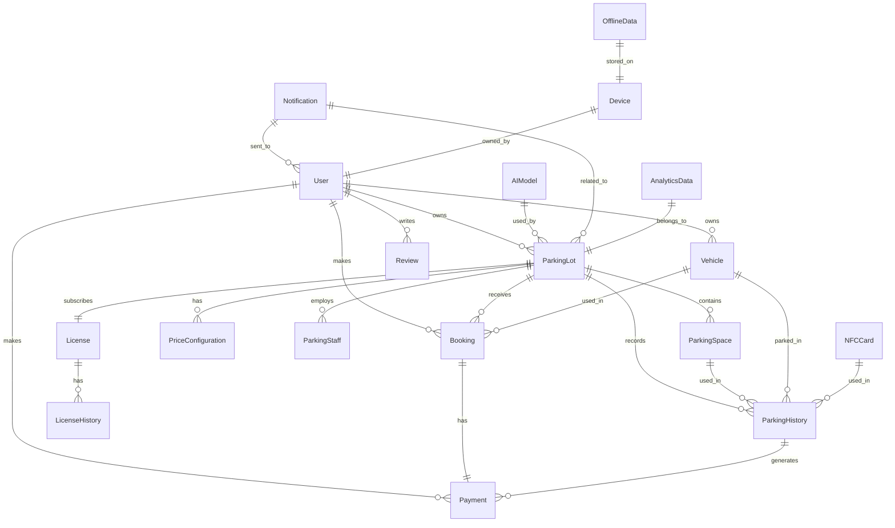

# Mô hình dữ liệu AI Parking

Tài liệu này mô tả chi tiết mô hình dữ liệu của hệ thống AI Parking, bao gồm các bảng, trường, và mối quan hệ giữa các thực thể.

## 1. Sơ đồ thực thể mối quan hệ (ERD)

## 2. Chi tiết các bảng

### 2.1. Quản lý người dùng

#### 2.1.1. Bảng `users`

| Trường | Kiểu dữ liệu | Mô tả |
|--------|--------------|-------|
| id | UUID | Khóa chính, định danh người dùng |
| email | VARCHAR(255) | Email người dùng, duy nhất |
| phone_number | VARCHAR(20) | Số điện thoại người dùng |
| password_hash | VARCHAR(255) | Mật khẩu đã mã hóa |
| full_name | VARCHAR(255) | Họ tên đầy đủ |
| role | ENUM | Vai trò: USER, PARKING_OWNER, PARKING_MANAGER, PARKING_STAFF, ADMIN |
| status | ENUM | Trạng thái: ACTIVE, INACTIVE, SUSPENDED |
| avatar_url | VARCHAR(255) | Đường dẫn đến avatar |
| created_at | TIMESTAMP | Thời gian tạo tài khoản |
| updated_at | TIMESTAMP | Thời gian cập nhật tài khoản |
| last_login | TIMESTAMP | Thời gian đăng nhập gần nhất |
| fcm_token | VARCHAR(255) | Token cho push notification |

#### 2.1.2. Bảng `user_profiles`

| Trường | Kiểu dữ liệu | Mô tả |
|--------|--------------|-------|
| id | UUID | Khóa chính |
| user_id | UUID | Khóa ngoại tham chiếu đến bảng users |
| address | VARCHAR(255) | Địa chỉ người dùng |
| city | VARCHAR(100) | Thành phố |
| country | VARCHAR(100) | Quốc gia |
| date_of_birth | DATE | Ngày sinh |
| gender | ENUM | Giới tính: MALE, FEMALE, OTHER |
| preferences | JSONB | Tùy chọn và cài đặt cá nhân |
| language | VARCHAR(10) | Ngôn ngữ ưa thích |
| created_at | TIMESTAMP | Thời gian tạo |
| updated_at | TIMESTAMP | Thời gian cập nhật |

#### 2.1.3. Bảng `vehicles`

| Trường | Kiểu dữ liệu | Mô tả |
|--------|--------------|-------|
| id | UUID | Khóa chính |
| user_id | UUID | Khóa ngoại tham chiếu đến bảng users |
| plate_number | VARCHAR(20) | Biển số xe |
| vehicle_type | ENUM | Loại xe: CAR, MOTORBIKE, BICYCLE, ELECTRIC_VEHICLE |
| brand | VARCHAR(100) | Thương hiệu xe |
| model | VARCHAR(100) | Mẫu xe |
| color | VARCHAR(50) | Màu sắc |
| is_default | BOOLEAN | Xe mặc định |
| created_at | TIMESTAMP | Thời gian tạo |
| updated_at | TIMESTAMP | Thời gian cập nhật |

### 2.2. Quản lý bãi đỗ xe

#### 2.2.1. Bảng `parking_lots`

| Trường | Kiểu dữ liệu | Mô tả |
|--------|--------------|-------|
| id | UUID | Khóa chính |
| owner_id | UUID | Khóa ngoại tham chiếu đến bảng users |
| name | VARCHAR(255) | Tên bãi đỗ xe |
| description | TEXT | Mô tả bãi đỗ xe |
| address | VARCHAR(255) | Địa chỉ |
| latitude | DECIMAL(10,8) | Vĩ độ |
| longitude | DECIMAL(11,8) | Kinh độ |
| total_spaces | INTEGER | Tổng số chỗ đỗ xe |
| status | ENUM | Trạng thái: ACTIVE, INACTIVE, MAINTENANCE |
| operating_hours | JSONB | Giờ hoạt động theo ngày |
| features | JSONB | Tính năng đặc biệt (camera, bảo vệ, etc.) |
| images | ARRAY | Danh sách URL hình ảnh |
| created_at | TIMESTAMP | Thời gian tạo |
| updated_at | TIMESTAMP | Thời gian cập nhật |
| license_id | UUID | Khóa ngoại tham chiếu đến bảng licenses |
| rtsp_camera_url | VARCHAR(255) | URL camera RTSP |
| ai_model_id | UUID | Khóa ngoại tham chiếu đến bảng ai_models |

#### 2.2.2. Bảng `parking_spaces`

| Trường | Kiểu dữ liệu | Mô tả |
|--------|--------------|-------|
| id | UUID | Khóa chính |
| parking_lot_id | UUID | Khóa ngoại tham chiếu đến bảng parking_lots |
| space_number | VARCHAR(10) | Số/mã chỗ đỗ xe |
| space_type | ENUM | Loại chỗ đỗ: STANDARD, COMPACT, HANDICAPPED, ELECTRIC_VEHICLE |
| status | ENUM | Trạng thái: AVAILABLE, OCCUPIED, RESERVED, MAINTENANCE |
| floor | INTEGER | Tầng (nếu có) |
| zone | VARCHAR(50) | Khu vực |
| is_covered | BOOLEAN | Có mái che hay không |
| created_at | TIMESTAMP | Thời gian tạo |
| updated_at | TIMESTAMP | Thời gian cập nhật |

#### 2.2.3. Bảng `price_configurations`

| Trường | Kiểu dữ liệu | Mô tả |
|--------|--------------|-------|
| id | UUID | Khóa chính |
| parking_lot_id | UUID | Khóa ngoại tham chiếu đến bảng parking_lots |
| vehicle_type | ENUM | Loại xe: CAR, MOTORBIKE, BICYCLE, ELECTRIC_VEHICLE |
| price_per_hour | DECIMAL(10,2) | Giá theo giờ |
| price_per_day | DECIMAL(10,2) | Giá theo ngày |
| price_per_week | DECIMAL(10,2) | Giá theo tuần |
| price_per_month | DECIMAL(10,2) | Giá theo tháng |
| minimum_hours | INTEGER | Số giờ tối thiểu |
| maximum_hours | INTEGER | Số giờ tối đa |
| early_bird_discount | DECIMAL(10,2) | Giảm giá cho người đến sớm |
| weekend_surcharge | DECIMAL(10,2) | Phụ thu cuối tuần |
| holiday_surcharge | DECIMAL(10,2) | Phụ thu ngày lễ |
| overnight_surcharge | DECIMAL(10,2) | Phụ thu qua đêm |
| effective_from | TIMESTAMP | Ngày hiệu lực |
| effective_to | TIMESTAMP | Ngày hết hiệu lực |
| created_at | TIMESTAMP | Thời gian tạo |
| updated_at | TIMESTAMP | Thời gian cập nhật |

#### 2.2.4. Bảng `parking_staff`

| Trường | Kiểu dữ liệu | Mô tả |
|--------|--------------|-------|
| id | UUID | Khóa chính |
| parking_lot_id | UUID | Khóa ngoại tham chiếu đến bảng parking_lots |
| user_id | UUID | Khóa ngoại tham chiếu đến bảng users |
| role | ENUM | Vai trò: MANAGER, ATTENDANT, SECURITY |
| shift_start | TIME | Giờ bắt đầu ca |
| shift_end | TIME | Giờ kết thúc ca |
| work_days | ARRAY | Các ngày làm việc |
| created_at | TIMESTAMP | Thời gian tạo |
| updated_at | TIMESTAMP | Thời gian cập nhật |

### 2.3. Quản lý đặt chỗ và lịch sử đỗ xe

#### 2.3.1. Bảng `bookings`

| Trường | Kiểu dữ liệu | Mô tả |
|--------|--------------|-------|
| id | UUID | Khóa chính |
| user_id | UUID | Khóa ngoại tham chiếu đến bảng users |
| parking_lot_id | UUID | Khóa ngoại tham chiếu đến bảng parking_lots |
| vehicle_id | UUID | Khóa ngoại tham chiếu đến bảng vehicles |
| space_id | UUID | Khóa ngoại tham chiếu đến bảng parking_spaces |
| booking_time | TIMESTAMP | Thời gian đặt chỗ |
| arrival_time | TIMESTAMP | Thời gian dự kiến đến |
| departure_time | TIMESTAMP | Thời gian dự kiến đi |
| status | ENUM | Trạng thái: PENDING, CONFIRMED, CANCELLED, COMPLETED |
| total_price | DECIMAL(10,2) | Tổng giá tiền |
| payment_status | ENUM | Trạng thái thanh toán: PENDING, PAID, REFUNDED |
| notes | TEXT | Ghi chú |
| created_at | TIMESTAMP | Thời gian tạo |
| updated_at | TIMESTAMP | Thời gian cập nhật |

#### 2.3.2. Bảng `parking_history`

| Trường | Kiểu dữ liệu | Mô tả |
|--------|--------------|-------|
| id | UUID | Khóa chính |
| parking_lot_id | UUID | Khóa ngoại tham chiếu đến bảng parking_lots |
| space_id | UUID | Khóa ngoại tham chiếu đến bảng parking_spaces |
| vehicle_id | UUID | Khóa ngoại tham chiếu đến bảng vehicles |
| booking_id | UUID | Khóa ngoại tham chiếu đến bảng bookings |
| check_in_time | TIMESTAMP | Thời gian vào |
| check_out_time | TIMESTAMP | Thời gian ra |
| check_in_method | ENUM | Phương thức check-in: NFC, LICENSE_PLATE, QR_CODE, MANUAL |
| check_out_method | ENUM | Phương thức check-out: NFC, LICENSE_PLATE, QR_CODE, MANUAL |
| license_plate_image_url | VARCHAR(255) | URL hình ảnh biển số xe |
| duration_minutes | INTEGER | Thời gian đỗ xe (phút) |
| total_price | DECIMAL(10,2) | Tổng giá tiền |
| created_by | UUID | Khóa ngoại tham chiếu đến bảng users (nhân viên ghi nhận) |
| created_at | TIMESTAMP | Thời gian tạo |
| updated_at | TIMESTAMP | Thời gian cập nhật |
| nfc_card_id | UUID | Khóa ngoại tham chiếu đến bảng nfc_cards |
| is_synced | BOOLEAN | Đã đồng bộ với server hay chưa |

### 2.4. Quản lý thanh toán

#### 2.4.1. Bảng `payments`

| Trường | Kiểu dữ liệu | Mô tả |
|--------|--------------|-------|
| id | UUID | Khóa chính |
| user_id | UUID | Khóa ngoại tham chiếu đến bảng users |
| booking_id | UUID | Khóa ngoại tham chiếu đến bảng bookings |
| parking_history_id | UUID | Khóa ngoại tham chiếu đến bảng parking_history |
| amount | DECIMAL(10,2) | Số tiền |
| currency | VARCHAR(3) | Loại tiền tệ (VND, USD) |
| payment_method | ENUM | Phương thức thanh toán: CASH, CREDIT_CARD, DEBIT_CARD, E_WALLET |
| payment_status | ENUM | Trạng thái: PENDING, COMPLETED, FAILED, REFUNDED |
| transaction_id | VARCHAR(255) | Mã giao dịch từ cổng thanh toán |
| payment_date | TIMESTAMP | Ngày thanh toán |
| invoice_number | VARCHAR(50) | Số hóa đơn |
| created_at | TIMESTAMP | Thời gian tạo |
| updated_at | TIMESTAMP | Thời gian cập nhật |

#### 2.4.2. Bảng `payment_methods`

| Trường | Kiểu dữ liệu | Mô tả |
|--------|--------------|-------|
| id | UUID | Khóa chính |
| user_id | UUID | Khóa ngoại tham chiếu đến bảng users |
| method_type | ENUM | Loại phương thức: CREDIT_CARD, DEBIT_CARD, E_WALLET |
| provider | VARCHAR(100) | Nhà cung cấp (Visa, Mastercard, Momo, etc.) |
| account_number | VARCHAR(255) | Số tài khoản (đã mã hóa) |
| expiry_date | DATE | Ngày hết hạn |
| is_default | BOOLEAN | Phương thức mặc định |
| created_at | TIMESTAMP | Thời gian tạo |
| updated_at | TIMESTAMP | Thời gian cập nhật |

### 2.5. Quản lý license

#### 2.5.1. Bảng `licenses`

| Trường | Kiểu dữ liệu | Mô tả |
|--------|--------------|-------|
| id | UUID | Khóa chính |
| package_name | VARCHAR(100) | Tên gói license |
| owner_id | UUID | Khóa ngoại tham chiếu đến bảng users |
| start_date | TIMESTAMP | Ngày bắt đầu |
| end_date | TIMESTAMP | Ngày kết thúc |
| status | ENUM | Trạng thái: ACTIVE, EXPIRED, SUSPENDED |
| max_parking_lots | INTEGER | Số lượng bãi đỗ tối đa |
| max_spaces | INTEGER | Số lượng chỗ đỗ tối đa |
| features | JSONB | Các tính năng được kích hoạt |
| license_key | VARCHAR(255) | Khóa license |
| created_at | TIMESTAMP | Thời gian tạo |
| updated_at | TIMESTAMP | Thời gian cập nhật |

#### 2.5.2. Bảng `license_history`

| Trường | Kiểu dữ liệu | Mô tả |
|--------|--------------|-------|
| id | UUID | Khóa chính |
| license_id | UUID | Khóa ngoại tham chiếu đến bảng licenses |
| action | ENUM | Hành động: CREATED, RENEWED, UPGRADED, SUSPENDED, TERMINATED |
| previous_end_date | TIMESTAMP | Ngày kết thúc trước đó |
| new_end_date | TIMESTAMP | Ngày kết thúc mới |
| payment_id | UUID | Khóa ngoại tham chiếu đến bảng payments |
| notes | TEXT | Ghi chú |
| performed_by | UUID | Khóa ngoại tham chiếu đến bảng users |
| created_at | TIMESTAMP | Thời gian tạo |

### 2.6. Đánh giá và phản hồi

#### 2.6.1. Bảng `reviews`

| Trường | Kiểu dữ liệu | Mô tả |
|--------|--------------|-------|
| id | UUID | Khóa chính |
| user_id | UUID | Khóa ngoại tham chiếu đến bảng users |
| parking_lot_id | UUID | Khóa ngoại tham chiếu đến bảng parking_lots |
| parking_history_id | UUID | Khóa ngoại tham chiếu đến bảng parking_history |
| rating | INTEGER | Đánh giá (1-5 sao) |
| comment | TEXT | Nhận xét |
| photos | ARRAY | Danh sách URL hình ảnh |
| is_anonymous | BOOLEAN | Đánh giá ẩn danh |
| created_at | TIMESTAMP | Thời gian tạo |
| updated_at | TIMESTAMP | Thời gian cập nhật |

### 2.7. Thông báo

#### 2.7.1. Bảng `notifications`

| Trường | Kiểu dữ liệu | Mô tả |
|--------|--------------|-------|
| id | UUID | Khóa chính |
| user_id | UUID | Khóa ngoại tham chiếu đến bảng users |
| title | VARCHAR(255) | Tiêu đề thông báo |
| body | TEXT | Nội dung thông báo |
| type | ENUM | Loại thông báo: BOOKING, PAYMENT, SYSTEM, PROMOTION, LICENSE |
| reference_id | UUID | ID tham chiếu (booking_id, payment_id, etc.) |
| is_read | BOOLEAN | Đã đọc hay chưa |
| created_at | TIMESTAMP | Thời gian tạo |
| updated_at | TIMESTAMP | Thời gian cập nhật |

### 2.8. Quản lý NFC

#### 2.8.1. Bảng `nfc_cards`

| Trường | Kiểu dữ liệu | Mô tả |
|--------|--------------|-------|
| id | UUID | Khóa chính |
| card_uid | VARCHAR(100) | UID của thẻ NFC |
| vehicle_id | UUID | Khóa ngoại tham chiếu đến bảng vehicles |
| user_id | UUID | Khóa ngoại tham chiếu đến bảng users |
| status | ENUM | Trạng thái: ACTIVE, INACTIVE, LOST |
| issue_date | TIMESTAMP | Ngày cấp |
| expiry_date | TIMESTAMP | Ngày hết hạn |
| created_at | TIMESTAMP | Thời gian tạo |
| updated_at | TIMESTAMP | Thời gian cập nhật |

### 2.9. Quản lý AI

#### 2.9.1. Bảng `ai_models`

| Trường | Kiểu dữ liệu | Mô tả |
|--------|--------------|-------|
| id | UUID | Khóa chính |
| model_name | VARCHAR(100) | Tên mô hình |
| model_type | ENUM | Loại mô hình: LICENSE_PLATE_RECOGNITION, DEMAND_FORECAST, REVENUE_OPTIMIZATION |
| version | VARCHAR(20) | Phiên bản |
| model_path | VARCHAR(255) | Đường dẫn đến file mô hình |
| model_size | INTEGER | Kích thước mô hình (KB) |
| accuracy | DECIMAL(5,2) | Độ chính xác |
| created_at | TIMESTAMP | Thời gian tạo |
| updated_at | TIMESTAMP | Thời gian cập nhật |

### 2.10. Phân tích dữ liệu

#### 2.10.1. Bảng `analytics_data`

| Trường | Kiểu dữ liệu | Mô tả |
|--------|--------------|-------|
| id | UUID | Khóa chính |
| parking_lot_id | UUID | Khóa ngoại tham chiếu đến bảng parking_lots |
| date | DATE | Ngày |
| hour | INTEGER | Giờ (0-23) |
| total_vehicles | INTEGER | Tổng số xe |
| total_revenue | DECIMAL(10,2) | Tổng doanh thu |
| average_duration | INTEGER | Thời gian đỗ trung bình (phút) |
| peak_time_start | TIME | Thời gian bắt đầu cao điểm |
| peak_time_end | TIME | Thời gian kết thúc cao điểm |
| occupancy_rate | DECIMAL(5,2) | Tỷ lệ lấp đầy (%) |
| created_at | TIMESTAMP | Thời gian tạo |
| updated_at | TIMESTAMP | Thời gian cập nhật |

### 2.11. Đồng bộ hóa offline

#### 2.11.1. Bảng `offline_data`

| Trường | Kiểu dữ liệu | Mô tả |
|--------|--------------|-------|
| id | UUID | Khóa chính |
| device_id | UUID | Khóa ngoại tham chiếu đến bảng devices |
| data_type | ENUM | Loại dữ liệu: PARKING_HISTORY, PAYMENT, BOOKING |
| data | JSONB | Dữ liệu offline |
| created_at | TIMESTAMP | Thời gian tạo |
| is_synced | BOOLEAN | Đã đồng bộ với server hay chưa |
| sync_time | TIMESTAMP | Thời gian đồng bộ |
| conflict_status | ENUM | Trạng thái xung đột: NONE, DETECTED, RESOLVED |
| conflict_resolution | JSONB | Chi tiết giải quyết xung đột |

#### 2.11.2. Bảng `devices`

| Trường | Kiểu dữ liệu | Mô tả |
|--------|--------------|-------|
| id | UUID | Khóa chính |
| user_id | UUID | Khóa ngoại tham chiếu đến bảng users |
| device_name | VARCHAR(100) | Tên thiết bị |
| device_type | ENUM | Loại thiết bị: SMARTPHONE, TABLET, KIOSK |
| device_os | VARCHAR(50) | Hệ điều hành |
| device_uuid | VARCHAR(100) | UUID của thiết bị |
| last_sync_time | TIMESTAMP | Thời gian đồng bộ gần nhất |
| created_at | TIMESTAMP | Thời gian tạo |
| updated_at | TIMESTAMP | Thời gian cập nhật |

## 3. Mối quan hệ chính

- **User - ParkingLot**: Một User có thể sở hữu nhiều ParkingLot
- **User - Vehicle**: Một User có thể sở hữu nhiều Vehicle
- **User - Booking**: Một User có thể có nhiều Booking
- **ParkingLot - ParkingSpace**: Một ParkingLot chứa nhiều ParkingSpace
- **ParkingLot - ParkingStaff**: Một ParkingLot có thể có nhiều ParkingStaff
- **ParkingLot - License**: Một ParkingLot phải có một License hợp lệ
- **Booking - Vehicle**: Một Booking liên kết với một Vehicle
- **Booking - ParkingSpace**: Một Booking đặt một ParkingSpace
- **ParkingHistory - Vehicle**: Một ParkingHistory ghi lại thông tin về một Vehicle
- **ParkingHistory - ParkingSpace**: Một ParkingHistory liên kết với một ParkingSpace
- **ParkingHistory - NFCCard**: Một ParkingHistory có thể được tạo bằng NFCCard
- **Payment - Booking**: Một Payment có thể liên kết với một Booking
- **Payment - ParkingHistory**: Một Payment có thể liên kết với một ParkingHistory
- **Device - OfflineData**: Một Device có thể lưu trữ nhiều OfflineData

## 4. Chỉ mục và tối ưu hóa

### 4.1. Chỉ mục chính

- `users`: email, phone_number
- `parking_lots`: owner_id, latitude+longitude (spatial index)
- `parking_spaces`: parking_lot_id, status
- `bookings`: user_id, parking_lot_id, status, arrival_time
- `parking_history`: parking_lot_id, vehicle_id, check_in_time, check_out_time
- `payments`: user_id, booking_id, payment_status
- `nfc_cards`: card_uid, vehicle_id
- `offline_data`: device_id, is_synced

### 4.2. Partition

- `parking_history`: Partition theo thời gian (monthly/quarterly)
- `payments`: Partition theo thời gian (monthly/quarterly)
- `analytics_data`: Partition theo thời gian (monthly)
- `notifications`: Partition theo user_id

## 5. Chiến lược cache

- **Cache của bãi đỗ xe gần đây**: Lưu trữ trong Redis với TTL 30 phút
- **Trạng thái bãi đỗ xe**: Lưu trữ trong Redis, cập nhật theo thời gian thực
- **Thông tin người dùng thường xuyên truy cập**: Lưu trữ trong Redis với TTL 15 phút
- **Kết quả phân tích phổ biến**: Lưu trữ trong Redis với TTL 1 giờ

## 6. Chiến lược backup và migration

### 6.1. Backup

- **Full backup**: Hàng ngày vào thời gian thấp điểm
- **Incremental backup**: Mỗi giờ
- **Transaction log backup**: Mỗi 15 phút
- **Retention policy**: 7 ngày cho incremental, 30 ngày cho full backup

### 6.2. Migration

- Sử dụng công cụ migration như Flyway hoặc Liquibase
- Version control cho schema changes
- Blue-green deployment cho các thay đổi lớn
- Rollback plan cho mỗi migration

## 7. Offline Data Synchronization

### 7.1. Chiến lược đồng bộ

- **Cơ chế đồng bộ**: Đồng bộ hai chiều (two-way sync)
- **Xử lý xung đột**: Last-write-wins với timestamp
- **Độ ưu tiên**: Server data > Client data trong trường hợp xung đột không giải quyết được
- **Tần suất đồng bộ**: Tự động khi có kết nối, thủ công theo yêu cầu người dùng

### 7.2. Cấu trúc dữ liệu offline

- SQLite database trên thiết bị di động
- Bảng đồng bộ với cấu trúc tương tự PostgreSQL
- Thêm trường meta để theo dõi trạng thái đồng bộ

## Kết luận

Mô hình dữ liệu của AI Parking được thiết kế để hỗ trợ đầy đủ các chức năng yêu cầu, đồng thời đảm bảo khả năng mở rộng và hiệu suất cao. Cấu trúc dữ liệu hỗ trợ hoạt động offline và đồng bộ hóa, cùng với quản lý license và các tính năng AI để nhận diện biển số xe và dự báo nhu cầu.

---
*Cập nhật: Đã bổ sung các bảng và trường liên quan đến quét thẻ NFC, xử lý offline, đồng bộ hóa dữ liệu, quản lý license và AI.*
