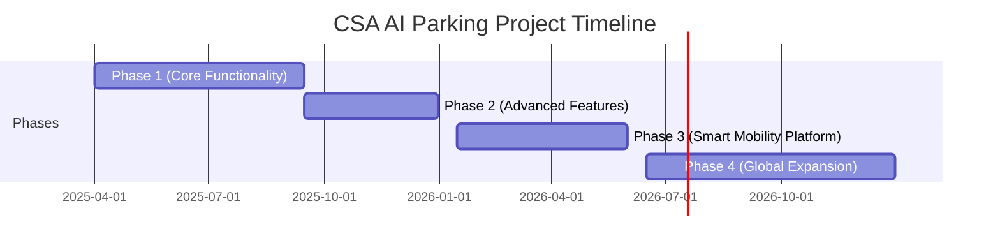
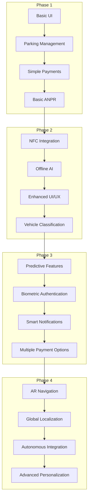
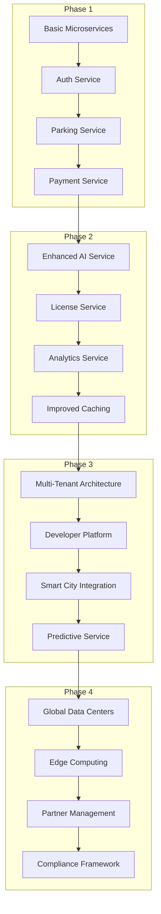
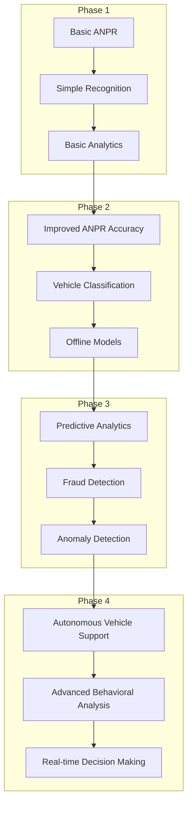
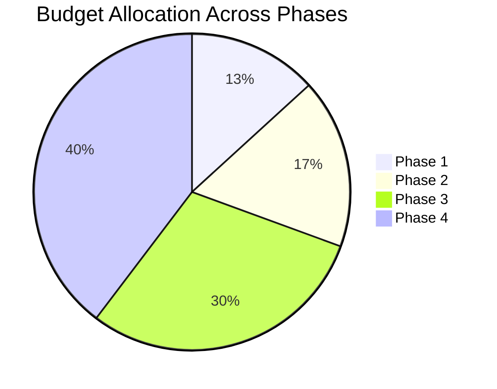

# Development Phases Overview

This document provides a comprehensive overview of the development phases for the CSA AI Parking project, outlining the progression from the initial MVP to a fully-featured smart mobility platform.

## Project Development Timeline

## Phase Comparison

| Feature Area | Phase 1 | Phase 2 | Phase 3 | Phase 4 (Planned) |
|--------------|---------|---------|---------|-------------------|
| **Core Functionality** | Basic parking management, ANPR, payments | Enhanced features, offline capabilities | Comprehensive platform, predictions | Global solution, full ecosystem |
| **Mobile App** | Basic UI, parking management | NFC, offline AI, enhanced UI | Predictive features, biometrics | Global localization, AR features |
| **Backend** | Basic microservices | Enhanced services, license management | Multi-tenant, developer platform | Global infrastructure, edge computing |
| **AI Capabilities** | Basic ANPR | Improved ANPR, vehicle classification | Predictive analytics, fraud detection | Advanced AI, autonomous integration |
| **Integrations** | Payment gateways | Multiple payment providers | Smart city integrations | Global partner ecosystem |
| **Security** | Basic security | Enhanced security | Biometrics, threat detection | Advanced security, compliance |
| **Scalability** | Single-tenant | Enhanced caching, performance | Multi-tenant, global data | Hyperscale, multi-region |

## Phase 1: Core Functionality

**Timeline**: April 1, 2025 - September 15, 2025

**Primary Goals**:

- Establish core parking management functionality
- Implement basic ANPR capabilities
- Create foundational mobile and web applications
- Set up essential backend services

**Key Deliverables**:

- Mobile application with basic parking management
- Web admin portal for operators
- ANPR integration for license plate recognition
- Payment processing integration
- User management and authentication

**Technical Focus**:

- Establishing the Clean Architecture patterns
- Setting up the microservices backend architecture
- Creating the CI/CD pipeline
- Implementing the foundational database schema

## Phase 2: Advanced Features

**Timeline**: September 15, 2025 - December 31, 2025

**Primary Goals**:

- Enhance core functionality with advanced features
- Implement offline capabilities
- Add NFC technology for contactless access
- Create flexible license management

**Key Deliverables**:

- NFC reader/writer functionality
- Offline AI processing for license plate recognition
- Enhanced UI/UX with improved accessibility
- Vehicle classification capabilities
- Flexible subscription management
- Advanced analytics and reporting

**Technical Focus**:

- Optimizing AI models for mobile devices
- Enhancing security features
- Improving caching and performance
- Refining database schema for new features

## Phase 3: Smart Mobility Platform

**Timeline**: January 15, 2026 - May 31, 2026

**Primary Goals**:

- Transform into comprehensive smart mobility platform
- Implement predictive capabilities
- Create developer ecosystem
- Enable multi-tenant architecture for enterprise customers

**Key Deliverables**:

- Predictive parking availability system
- Smart city integrations and partnerships
- Developer platform with APIs and SDKs
- Advanced business intelligence
- Biometric authentication options
- Multi-tenant architecture

**Technical Focus**:

- Building predictive analytics infrastructure
- Implementing secure multi-tenant architecture
- Creating developer platform and documentation
- Enhancing system scalability

## Phase 4: Global Expansion (Planned)

**Timeline**: June 15, 2026 - December 31, 2026

**Primary Goals**:

- Expand platform globally with localization
- Integrate with autonomous vehicle systems
- Enhance platform with AR capabilities
- Create global partner ecosystem

**Key Deliverables**:

- Localized versions for multiple regions/languages
- Autonomous vehicle integration
- AR navigation and parking assistance
- Global partner portal and management system
- Advanced edge computing capabilities
- Compliance with international regulations

**Technical Focus**:

- Global infrastructure with regional data centers
- Edge computing for improved performance
- Advanced AI for autonomous vehicle integration
- Comprehensive compliance framework

## Feature Evolution Across Phases

### Mobile Application Evolution

### Backend Evolution

### AI Capabilities Evolution

## Key Metrics Comparison

| Metric | Phase 1 | Phase 2 | Phase 3 | Phase 4 (Target) |
|--------|---------|---------|---------|------------------|
| Concurrent Users | Baseline | 50% increase | 100% increase | 500% increase |
| AI Accuracy | 90% | 95%+ | 97%+ | 99%+ |
| System Uptime | 99.5% | 99.9% | 99.95% | 99.99% |
| API Response Time | <500ms | <200ms | <150ms | <100ms |
| Mobile App Load Time | <3s | <2s | <1.5s | <1s |
| Revenue Growth | Baseline | 20% increase | 40% increase | 100% increase |

## Budget Allocation Across Phases

## Risk Evolution and Mitigation

| Phase | Primary Risks | Mitigation Strategies |
|-------|---------------|------------------------|
| Phase 1 | Technical foundation issues, MVP adoption | Thorough planning, agile approach, early user feedback |
| Phase 2 | NFC integration complexity, offline performance | Early prototyping, gradual rollout, extensive testing |
| Phase 3 | Smart city integration complexity, predictive accuracy | Phased approach, dedicated integration team, A/B testing |
| Phase 4 | Global regulatory compliance, scalability | Regional legal teams, containerized architecture, auto-scaling |

## Conclusion

The phased development approach for the CSA AI Parking project enables a systematic evolution from a core parking management system to a comprehensive smart mobility platform. Each phase builds upon the previous one, adding new capabilities while enhancing existing features.

This incremental approach allows for:

- Risk management through early validation
- Continuous user feedback incorporation
- Revenue generation beginning in Phase 1
- Scalable architecture that grows with the user base
- Systematic expansion of the feature set

The ultimate vision is to create a global smart mobility platform that integrates seamlessly with smart city infrastructure and provides predictive, personalized parking solutions for both individual users and enterprise customers.
