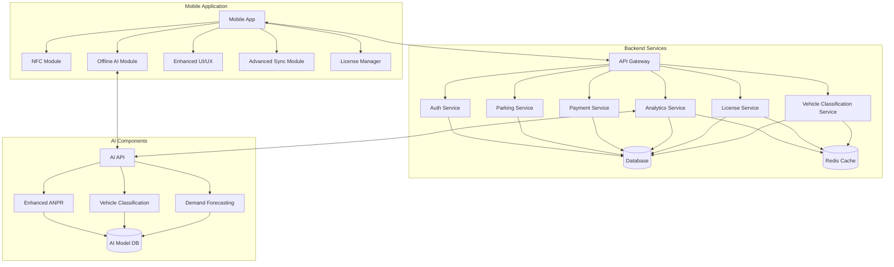
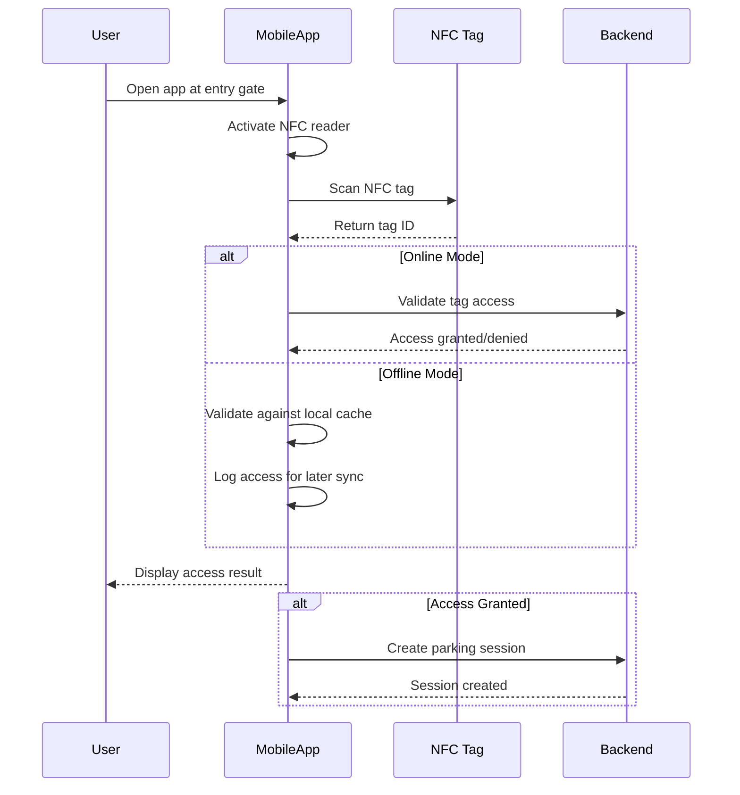
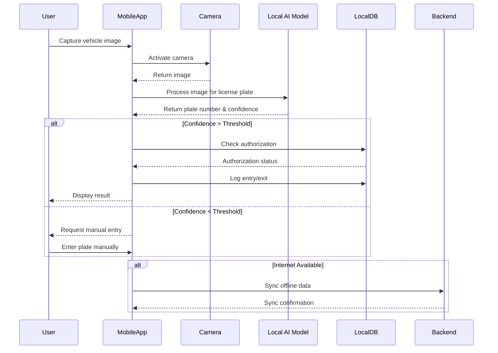

# Phase 2 Design Document

## 1. Introduction

This document outlines the detailed design for Phase 2 of the CSA AI Parking project. Building upon the foundation established in Phase 1, this phase focuses on implementing advanced features, enhancing AI capabilities, and improving overall system performance and scalability.

## 2. Phase 2 Scope

Phase 2 encompasses the following key enhancements:

- NFC technology integration for contactless access
- Offline AI processing capabilities
- Flexible license management system
- Advanced vehicle classification
- Enhanced analytics and reporting
- Security improvements
- Performance optimization

## 3. Architecture Updates

### 3.1 System Architecture Diagram



### 3.2 Architectural Changes

1. **Mobile Application**:
   - Added NFC module for contactless access
   - Integrated offline AI processing module
   - Enhanced sync mechanism for offline-to-online data transfer
   - Added license management component

2. **Backend Services**:
   - Added dedicated License Service for managing subscription types
   - Added Vehicle Classification Service
   - Enhanced Analytics Service with advanced reporting
   - Improved caching strategy for better performance

3. **AI Components**:
   - Upgraded ANPR for higher accuracy
   - Added vehicle classification capabilities
   - Enhanced model delivery and versioning system
   - Optimized models for mobile execution

## 4. Database Schema Updates

### 4.1 New Tables

```sql
-- License management tables
CREATE TABLE license_plans (
    id UUID PRIMARY KEY,
    name VARCHAR(100) NOT NULL,
    description TEXT,
    duration_days INTEGER NOT NULL,
    price DECIMAL(10,2) NOT NULL,
    features JSONB NOT NULL,
    max_users INTEGER NOT NULL,
    max_locations INTEGER NOT NULL,
    created_at TIMESTAMP WITH TIME ZONE DEFAULT NOW(),
    updated_at TIMESTAMP WITH TIME ZONE DEFAULT NOW()
);

CREATE TABLE customer_licenses (
    id UUID PRIMARY KEY,
    customer_id UUID NOT NULL REFERENCES users(id),
    license_plan_id UUID NOT NULL REFERENCES license_plans(id),
    start_date TIMESTAMP WITH TIME ZONE NOT NULL,
    end_date TIMESTAMP WITH TIME ZONE NOT NULL,
    status VARCHAR(20) NOT NULL,
    payment_id UUID REFERENCES payments(id),
    features_override JSONB,
    created_at TIMESTAMP WITH TIME ZONE DEFAULT NOW(),
    updated_at TIMESTAMP WITH TIME ZONE DEFAULT NOW()
);

-- Vehicle classification tables
CREATE TABLE vehicle_types (
    id UUID PRIMARY KEY,
    name VARCHAR(50) NOT NULL,
    description TEXT,
    created_at TIMESTAMP WITH TIME ZONE DEFAULT NOW(),
    updated_at TIMESTAMP WITH TIME ZONE DEFAULT NOW()
);

CREATE TABLE vehicle_makes (
    id UUID PRIMARY KEY,
    name VARCHAR(50) NOT NULL,
    country VARCHAR(50),
    created_at TIMESTAMP WITH TIME ZONE DEFAULT NOW(),
    updated_at TIMESTAMP WITH TIME ZONE DEFAULT NOW()
);

CREATE TABLE vehicle_models (
    id UUID PRIMARY KEY,
    make_id UUID NOT NULL REFERENCES vehicle_makes(id),
    name VARCHAR(50) NOT NULL,
    year_from INTEGER,
    year_to INTEGER,
    created_at TIMESTAMP WITH TIME ZONE DEFAULT NOW(),
    updated_at TIMESTAMP WITH TIME ZONE DEFAULT NOW()
);

-- NFC tables
CREATE TABLE nfc_tags (
    id UUID PRIMARY KEY,
    tag_id VARCHAR(100) UNIQUE NOT NULL,
    vehicle_id UUID REFERENCES vehicles(id),
    user_id UUID REFERENCES users(id),
    status VARCHAR(20) NOT NULL,
    issued_at TIMESTAMP WITH TIME ZONE NOT NULL,
    expires_at TIMESTAMP WITH TIME ZONE,
    last_used_at TIMESTAMP WITH TIME ZONE,
    created_at TIMESTAMP WITH TIME ZONE DEFAULT NOW(),
    updated_at TIMESTAMP WITH TIME ZONE DEFAULT NOW()
);

CREATE TABLE nfc_access_logs (
    id UUID PRIMARY KEY,
    nfc_tag_id UUID REFERENCES nfc_tags(id),
    location_id UUID REFERENCES parking_locations(id),
    entry_exit VARCHAR(10) NOT NULL,
    timestamp TIMESTAMP WITH TIME ZONE NOT NULL,
    processed_offline BOOLEAN DEFAULT FALSE,
    created_at TIMESTAMP WITH TIME ZONE DEFAULT NOW()
);
```

### 4.2 Schema Updates to Existing Tables

```sql
-- Update vehicles table to include classification data
ALTER TABLE vehicles 
ADD COLUMN vehicle_type_id UUID REFERENCES vehicle_types(id),
ADD COLUMN vehicle_make_id UUID REFERENCES vehicle_makes(id),
ADD COLUMN vehicle_model_id UUID REFERENCES vehicle_models(id),
ADD COLUMN color VARCHAR(30),
ADD COLUMN classified_by VARCHAR(20),
ADD COLUMN classification_confidence DECIMAL(5,2);

-- Update parking_sessions table to track access method
ALTER TABLE parking_sessions
ADD COLUMN access_method VARCHAR(20),
ADD COLUMN nfc_tag_id UUID REFERENCES nfc_tags(id);

-- Update users table to support license management
ALTER TABLE users
ADD COLUMN active_license_id UUID REFERENCES customer_licenses(id);

-- Update parking_locations table to support offline mode
ALTER TABLE parking_locations
ADD COLUMN supports_offline_mode BOOLEAN DEFAULT FALSE,
ADD COLUMN offline_ai_version VARCHAR(20);
```

## 5. API Endpoints

### 5.1 NFC Management API

```http
# NFC Tag Management
POST   /api/v1/nfc/tags               # Create a new NFC tag
GET    /api/v1/nfc/tags               # List all NFC tags
GET    /api/v1/nfc/tags/{id}          # Get NFC tag details
PUT    /api/v1/nfc/tags/{id}          # Update NFC tag
DELETE /api/v1/nfc/tags/{id}          # Delete/deactivate NFC tag
POST   /api/v1/nfc/tags/{id}/assign   # Assign tag to vehicle/user
GET    /api/v1/nfc/stats              # Get NFC usage statistics

# NFC Access Control
POST   /api/v1/nfc/access/validate    # Validate NFC access (online)
GET    /api/v1/nfc/access/logs        # Get access logs
POST   /api/v1/nfc/access/sync        # Sync offline access logs
```

### 5.2 License Management API

```http
# License Plans
GET    /api/v1/licenses/plans             # List available license plans
GET    /api/v1/licenses/plans/{id}        # Get license plan details
POST   /api/v1/licenses/plans             # Create license plan (admin)
PUT    /api/v1/licenses/plans/{id}        # Update license plan (admin)
DELETE /api/v1/licenses/plans/{id}        # Delete license plan (admin)

# Customer Licenses
GET    /api/v1/licenses/customer          # List customer licenses
GET    /api/v1/licenses/customer/{id}     # Get customer license details
POST   /api/v1/licenses/customer/purchase # Purchase a license
PUT    /api/v1/licenses/customer/{id}     # Update customer license
POST   /api/v1/licenses/customer/{id}/renew # Renew license
```

### 5.3 Vehicle Classification API

```http
# Vehicle Classification
POST   /api/v1/vehicles/classify       # Classify vehicle from image
GET    /api/v1/vehicles/types          # Get vehicle types
GET    /api/v1/vehicles/makes          # Get vehicle makes
GET    /api/v1/vehicles/makes/{id}/models # Get models for a make
```

### 5.4 Offline Mode API

```http
# Offline Mode Management
GET    /api/v1/offline/status          # Check offline mode status
POST   /api/v1/offline/sync            # Sync offline data
GET    /api/v1/offline/models          # Get available offline models
POST   /api/v1/offline/models/download # Download model for offline use
```

### 5.5 Enhanced Analytics API

```http
# Advanced Analytics
GET    /api/v1/analytics/dashboard     # Get dashboard analytics
GET    /api/v1/analytics/reports       # Get predefined reports
POST   /api/v1/analytics/reports/custom # Generate custom report
GET    /api/v1/analytics/parking/usage # Get parking usage analytics
GET    /api/v1/analytics/revenue       # Get revenue analytics
GET    /api/v1/analytics/forecasts     # Get demand forecasts
```

## 6. Mobile App Updates

### 6.1 NFC Module

The NFC module will enable contactless entry/exit at parking facilities using NFC tags:

- NFC tag reading functionality for vehicle identification
- Tag issuance and management for parking operators
- Secure communication with the backend for validation
- Fallback to offline validation when connectivity is unavailable

**NFC User Flow**:



### 6.2 Offline AI Module

The offline AI module will enable license plate recognition without internet connectivity:

- Optimized TensorFlow Lite model for on-device inference
- Local database for authorized vehicles
- Periodic sync with backend when connectivity is restored
- Performance optimization for various device capabilities

**Offline AI Processing Flow**:



### 6.3 License Management UI

The app will include a new license management interface for:

- Viewing current license details
- Managing subscription plans
- Handling license renewals
- Setting up automatic payments
- Viewing feature entitlements

### 6.4 Vehicle Classification UI

New UI components for displaying:

- Vehicle type classification
- Make and model recognition
- Color identification
- Classification confidence

## 7. Security Enhancements

### 7.1 NFC Security

- Secure element utilization for cryptographic operations
- Tag authentication with digital signatures
- Anti-cloning measures for NFC tags
- Rate limiting for NFC operations

### 7.2 Offline Data Security

- Encrypted local storage for sensitive data
- Secure key management for offline operation
- Data integrity validation during sync operations
- Automatic data purging based on retention policies

### 7.3 License Validation Security

- License cryptographic validation
- Tamper-resistant license certificates
- Secure license activation process
- License revocation mechanism

## 8. Deployment Strategy

### 8.1 Backend Deployment

1. Database schema migration with zero downtime
2. Rolling updates for microservices
3. Phased deployment of new services
4. Blue-green deployment for critical components

### 8.2 Mobile App Deployment

1. Phased rollout to test groups
2. Feature flags for gradual feature activation
3. A/B testing for new UI components
4. Automated rollback capability

### 8.3 AI Model Deployment

1. Shadow deployment for model validation
2. Progressive model updates
3. Performance monitoring during rollout
4. Fallback to previous model versions if issues detected

## 9. Testing Strategy

### 9.1 NFC Testing

- Hardware compatibility testing across device models
- Field testing in various environmental conditions
- Performance testing for read speed and reliability
- Security penetration testing

### 9.2 Offline AI Testing

- Accuracy testing across different lighting conditions
- Performance testing on various device specifications
- Battery consumption analysis
- Storage utilization testing

### 9.3 License Management Testing

- Integration testing with payment providers
- Validation of license enforcement
- Stress testing for license validation system
- User acceptance testing for management interface

## 10. Performance Optimization

### 10.1 Mobile App Optimization

- Memory usage optimization for offline AI
- Battery usage optimization
- Cold start time improvement
- Network bandwidth reduction

### 10.2 Backend Optimization

- Query optimization for high-traffic endpoints
- Caching strategy enhancement
- Database index optimization
- Horizontal scaling improvements
- Load balancing refinement

## 11. KPIs and Monitoring

### 11.1 Key Performance Indicators

| Category | KPI | Target | Measurement Method |
|----------|-----|--------|-------------------|
| Performance | API Response Time | < 200ms | Application monitoring |
| Performance | Mobile App Cold Start | < 2s | Analytics tracking |
| AI | ANPR Accuracy | > 95% | Validation against ground truth |
| AI | Vehicle Classification Accuracy | > 90% | Validation against ground truth |
| Security | Security Vulnerabilities | 0 critical/high | Security scanning |
| Business | License Conversion Rate | > 15% | License purchase tracking |
| Business | NFC Tag Adoption | > 30% | Tag issuance tracking |
| System | System Uptime | > 99.9% | Infrastructure monitoring |
| System | Offline Sync Success Rate | > 99% | Sync logs analysis |

### 11.2 Monitoring Setup

- Enhanced Prometheus metrics collection
- Grafana dashboards for new components
- Alert configuration for critical thresholds
- Log aggregation for offline operations
- User experience monitoring

## 12. Conclusion

Phase 2 builds upon the foundation established in Phase 1, adding sophisticated features that enhance the user experience, improve system reliability, and open new revenue streams. The NFC integration, offline AI capabilities, and license management system represent significant advances in the platform's capabilities, positioning it for broader market adoption and improved customer satisfaction.

## 13. Appendices

### 13.1 Technology Stack Updates

| Component | Technology | Version | Purpose |
|-----------|------------|---------|---------|
| Mobile NFC | Flutter NFC Manager | 3.2.0 | NFC tag reading/writing |
| Offline AI | TensorFlow Lite | 2.12.0 | On-device inference |
| Local Storage | Hive | 2.2.3 | Offline data storage |
| Vehicle Classification | EfficientNet | B3 | Vehicle type/make/model detection |
| License Management | JWT | - | License validation |
| Caching | Redis | 7.0 | Enhanced caching |

### 13.2 Third-Party Integrations

- NFC tag provider integration
- Additional payment gateway support
- License management service integration
- Advanced analytics tools integration
