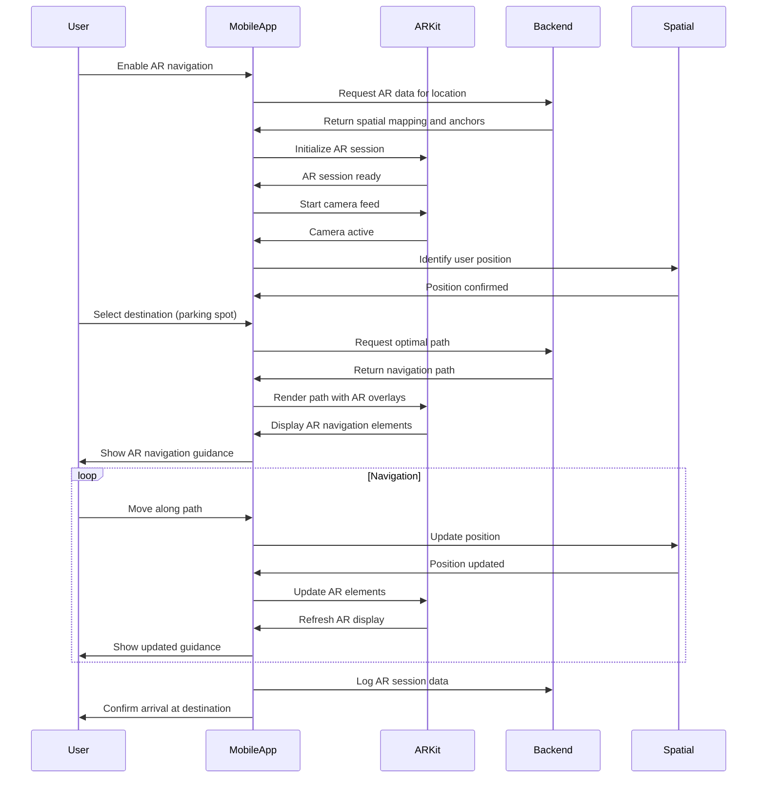
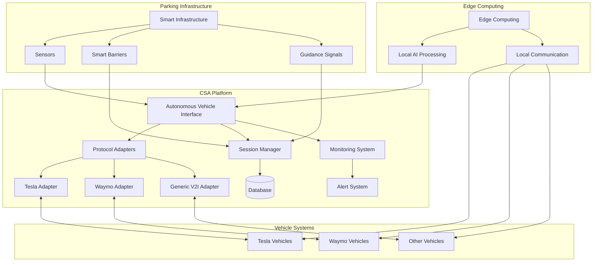
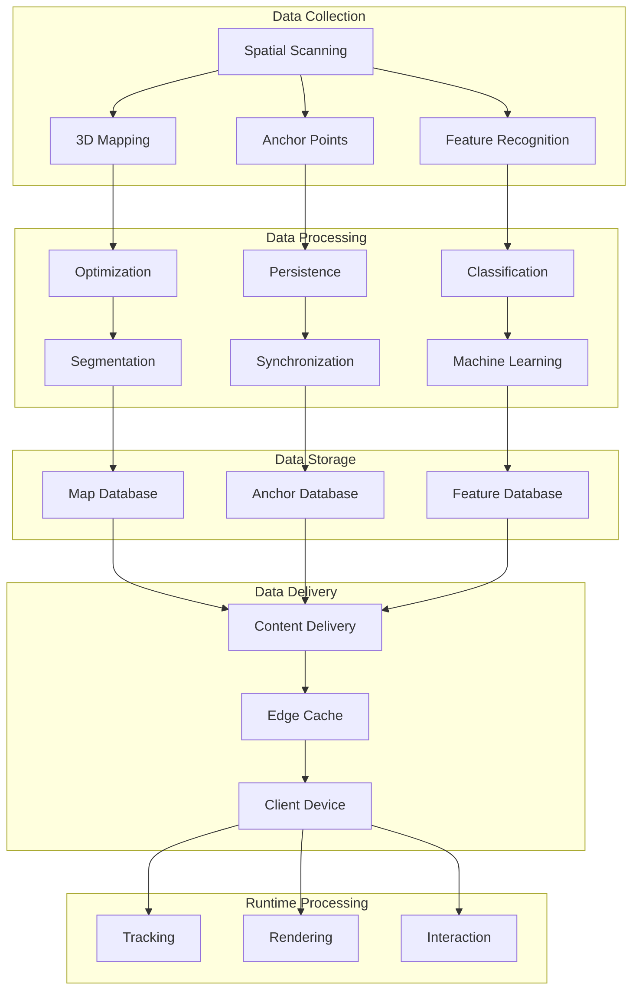
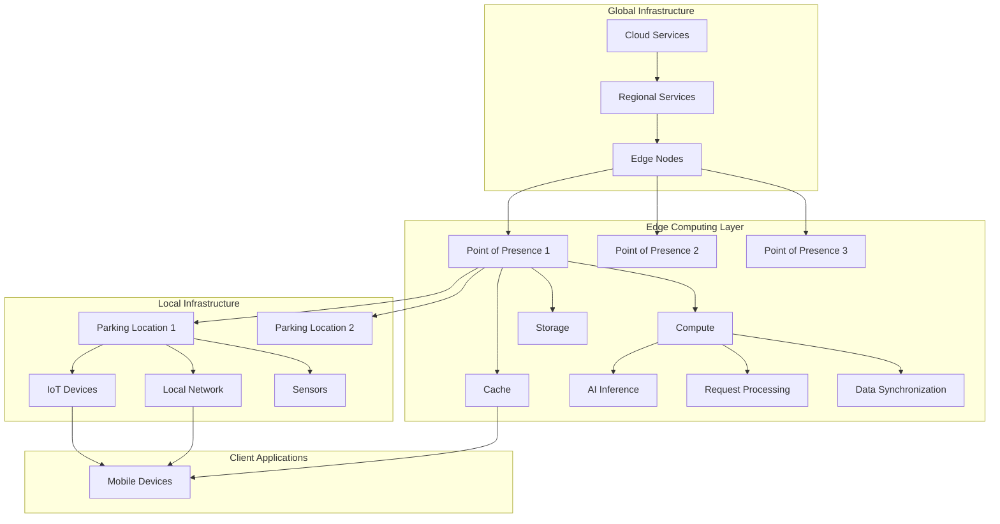
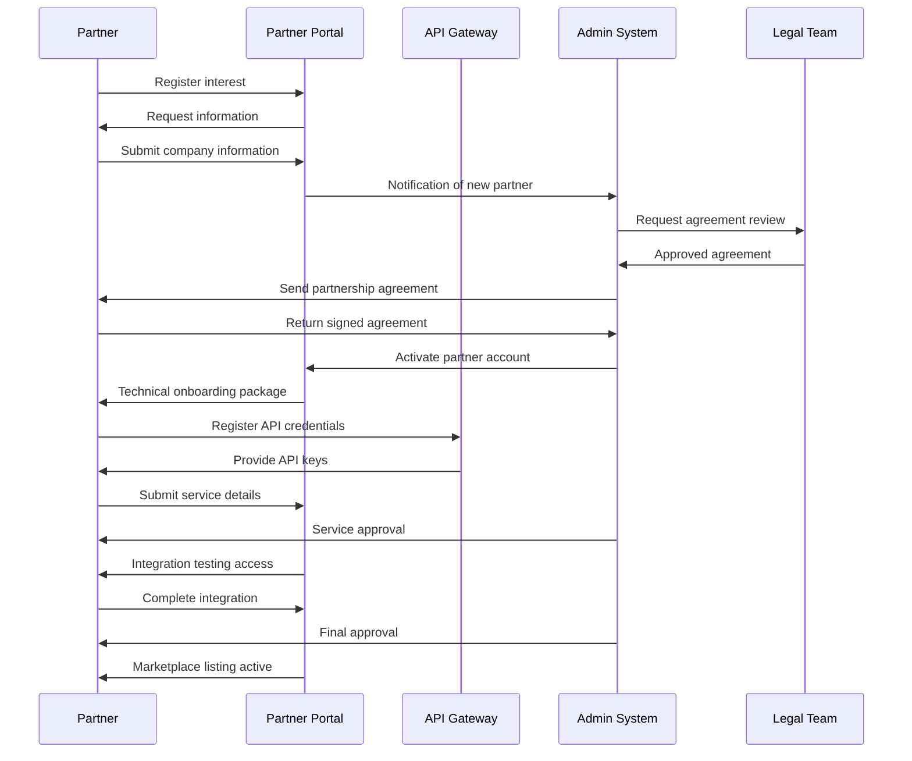
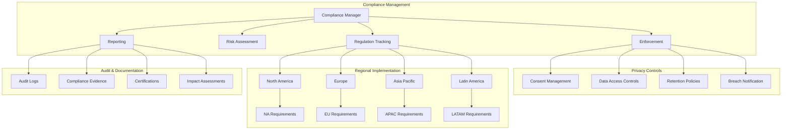
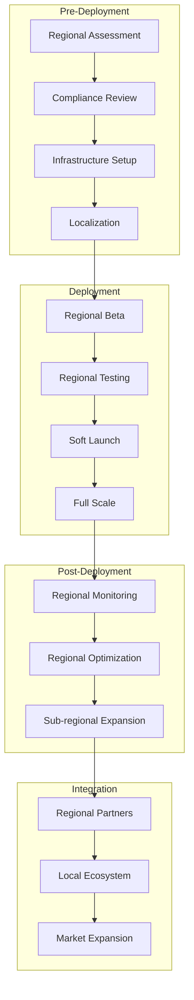

# Phase 4 Design Document

## 1. Introduction

This document outlines the detailed design for Phase 4 of the CSA AI Parking project. As the final planned phase of development, Phase 4 elevates the platform to a global scale with advanced features for autonomous vehicles, augmented reality, and a comprehensive partner ecosystem. Building upon the solid foundation established in Phases 1-3, Phase 4 represents the culmination of our vision for a next-generation smart mobility platform.

## 2. Phase 4 Scope

Phase 4 encompasses the following key advancements:

- Global expansion with full localization
- Autonomous vehicle integration
- Augmented reality (AR) navigation and assistance
- Global partner ecosystem and marketplace
- Edge computing infrastructure
- International regulatory compliance
- Global data infrastructure

## 3. Architecture Updates

### 3.1 Global System Architecture Diagram

```mermaid
graph TD
    subgraph "Client Applications"
        MA[Mobile App] --> MAAR[AR Navigation]
        MA --> MAAV[Autonomous Vehicle]
        MA --> MAGLOBE[Global Localization]
        MA --> MAEDGE[Edge Processing]
        
        WEB[Web Platform] --> WEBPARTNER[Partner Portal]
        WEB --> WEBGLOBAL[Global Admin]
        WEB --> WEBMARKETPLACE[Marketplace]
    end
    
    subgraph "Global API Layer"
        APIG[Global API Gateway] --> CDN[Global CDN]
        APIG --> EDGE[Edge Compute]
        APIG --> REGION[Regional Routing]
    end
    
    subgraph "Regional Deployments"
        REGION --> NA[North America]
        REGION --> EU[Europe]
        REGION --> APAC[Asia Pacific]
        REGION --> LATAM[Latin America]
        
        subgraph "Regional Instance"
            NA --> NAMS[Microservices]
            NA --> NADB[Database]
            NA --> NAREDIS[Cache]
            NA --> NAAUTO[Autonomous]
        end
    end
    
    subgraph "Global Services"
        GS[Global Sync] --> GSDATA[Data Synchronization]
        GS --> GSCONFIG[Configuration Management]
        GS --> GSANALYTICS[Global Analytics]
        GS --> GSCOMPLIANCE[Compliance Management]
    end
    
    subgraph "Partner Ecosystem"
        PE[Partner Gateway] --> PEAPI[Partner APIs]
        PE --> PEBILLING[Partner Billing]
        PE --> PEMETRICS[Partner Metrics]
        PE --> PEAUTH[Partner Auth]
    end
    
    subgraph "Advanced AI Platform"
        AI[Global AI] --> AIAUTO[Autonomous Vehicle AI]
        AI --> AIAR[AR Intelligence]
        AI --> AIBEHAVE[Behavioral Analysis]
        AI --> AIPREDICT[Global Predictions]
        
        AIAUTO --> AIDB[(AI Model DB)]
        AIAR --> AIDB
        AIBEHAVE --> AIDB
        AIPREDICT --> AIDB
    end
    
    MA <--> APIG
    WEB <--> APIG
    APIG <--> GS
    APIG <--> PE
    NA <--> GS
    EU <--> GS
    APAC <--> GS
    LATAM <--> GS
    PE <--> AI
```



### 3.2 Architectural Changes

1. **Global Infrastructure**:
   - Multi-region deployment architecture
   - Global content delivery network (CDN)
   - Regional data isolation with global synchronization
   - Edge computing nodes for low-latency processing

2. **Autonomous Vehicle Integration**:
   - Standardized communication protocols
   - Real-time data exchange architecture
   - Autonomous parking coordination system
   - Vehicle-to-infrastructure communication

3. **AR System Architecture**:
   - AR processing pipeline
   - Spatial mapping services
   - Real-time environment understanding
   - Visual positioning system

4. **Partner Ecosystem**:
   - Partner API gateway
   - Marketplace infrastructure
   - Partner onboarding and management system
   - Revenue sharing and billing system

5. **Global Compliance Framework**:
   - Regional compliance enforcement
   - Data residency controls
   - Privacy management system
   - Audit and reporting infrastructure

## 4. Database Schema Updates

### 4.1 New Tables

```sql
-- Global localization tables
CREATE TABLE localization_settings (
    id UUID PRIMARY KEY,
    tenant_id UUID REFERENCES tenants(id),
    language_code VARCHAR(10) NOT NULL,
    country_code VARCHAR(10) NOT NULL,
    date_format VARCHAR(50) NOT NULL,
    time_format VARCHAR(50) NOT NULL,
    currency_code VARCHAR(10) NOT NULL,
    measurement_system VARCHAR(20) NOT NULL,
    created_at TIMESTAMP WITH TIME ZONE DEFAULT NOW(),
    updated_at TIMESTAMP WITH TIME ZONE DEFAULT NOW(),
    UNIQUE(tenant_id, language_code, country_code)
);

CREATE TABLE localized_content (
    id UUID PRIMARY KEY,
    content_key VARCHAR(255) NOT NULL,
    language_code VARCHAR(10) NOT NULL,
    content_text TEXT NOT NULL,
    content_type VARCHAR(50) NOT NULL,
    status VARCHAR(20) NOT NULL,
    created_at TIMESTAMP WITH TIME ZONE DEFAULT NOW(),
    updated_at TIMESTAMP WITH TIME ZONE DEFAULT NOW(),
    UNIQUE(content_key, language_code)
);

-- Autonomous vehicle tables
CREATE TABLE autonomous_vehicles (
    id UUID PRIMARY KEY,
    vehicle_id UUID REFERENCES vehicles(id),
    manufacturer VARCHAR(100) NOT NULL,
    model VARCHAR(100) NOT NULL,
    protocol_version VARCHAR(20) NOT NULL,
    capabilities JSONB NOT NULL,
    authentication_key VARCHAR(255),
    status VARCHAR(20) NOT NULL,
    last_communication TIMESTAMP WITH TIME ZONE,
    created_at TIMESTAMP WITH TIME ZONE DEFAULT NOW(),
    updated_at TIMESTAMP WITH TIME ZONE DEFAULT NOW()
);

CREATE TABLE autonomous_parking_sessions (
    id UUID PRIMARY KEY,
    vehicle_id UUID REFERENCES autonomous_vehicles(id),
    parking_session_id UUID REFERENCES parking_sessions(id),
    entry_instructions JSONB,
    exit_instructions JSONB,
    vehicle_position JSONB,
    status VARCHAR(20) NOT NULL,
    communication_logs JSONB,
    created_at TIMESTAMP WITH TIME ZONE DEFAULT NOW(),
    updated_at TIMESTAMP WITH TIME ZONE DEFAULT NOW()
);

CREATE TABLE autonomous_parking_spots (
    id UUID PRIMARY KEY,
    location_id UUID REFERENCES parking_locations(id),
    spot_identifier VARCHAR(50) NOT NULL,
    dimensions JSONB NOT NULL,
    has_charger BOOLEAN DEFAULT FALSE,
    is_accessible BOOLEAN DEFAULT FALSE,
    autonomous_compatible BOOLEAN DEFAULT TRUE,
    navigation_markers JSONB,
    status VARCHAR(20) NOT NULL,
    created_at TIMESTAMP WITH TIME ZONE DEFAULT NOW(),
    updated_at TIMESTAMP WITH TIME ZONE DEFAULT NOW(),
    UNIQUE(location_id, spot_identifier)
);

-- AR navigation tables
CREATE TABLE ar_navigation_data (
    id UUID PRIMARY KEY,
    location_id UUID REFERENCES parking_locations(id),
    ar_model_version VARCHAR(20) NOT NULL,
    spatial_map BYTEA,
    anchor_points JSONB,
    navigation_paths JSONB,
    visual_markers JSONB,
    created_at TIMESTAMP WITH TIME ZONE DEFAULT NOW(),
    updated_at TIMESTAMP WITH TIME ZONE DEFAULT NOW()
);

CREATE TABLE ar_user_sessions (
    id UUID PRIMARY KEY,
    user_id UUID REFERENCES users(id),
    location_id UUID REFERENCES parking_locations(id),
    session_start TIMESTAMP WITH TIME ZONE NOT NULL,
    session_end TIMESTAMP WITH TIME ZONE,
    device_info JSONB,
    ar_features_used JSONB,
    performance_metrics JSONB,
    created_at TIMESTAMP WITH TIME ZONE DEFAULT NOW(),
    updated_at TIMESTAMP WITH TIME ZONE DEFAULT NOW()
);

-- Partner ecosystem tables
CREATE TABLE partners (
    id UUID PRIMARY KEY,
    name VARCHAR(100) NOT NULL,
    partner_type VARCHAR(50) NOT NULL,
    contact_info JSONB NOT NULL,
    integration_details JSONB,
    status VARCHAR(20) NOT NULL,
    commission_rate DECIMAL(5,2),
    agreement_details JSONB,
    onboarding_date TIMESTAMP WITH TIME ZONE NOT NULL,
    created_at TIMESTAMP WITH TIME ZONE DEFAULT NOW(),
    updated_at TIMESTAMP WITH TIME ZONE DEFAULT NOW()
);

CREATE TABLE partner_services (
    id UUID PRIMARY KEY,
    partner_id UUID REFERENCES partners(id),
    service_name VARCHAR(100) NOT NULL,
    service_description TEXT NOT NULL,
    service_category VARCHAR(50) NOT NULL,
    pricing_model JSONB NOT NULL,
    integration_type VARCHAR(50) NOT NULL,
    api_endpoints JSONB,
    status VARCHAR(20) NOT NULL,
    created_at TIMESTAMP WITH TIME ZONE DEFAULT NOW(),
    updated_at TIMESTAMP WITH TIME ZONE DEFAULT NOW()
);

CREATE TABLE partner_transactions (
    id UUID PRIMARY KEY,
    partner_id UUID REFERENCES partners(id),
    service_id UUID REFERENCES partner_services(id),
    user_id UUID REFERENCES users(id),
    transaction_amount DECIMAL(10,2) NOT NULL,
    commission_amount DECIMAL(10,2) NOT NULL,
    transaction_details JSONB NOT NULL,
    status VARCHAR(20) NOT NULL,
    transaction_date TIMESTAMP WITH TIME ZONE NOT NULL,
    created_at TIMESTAMP WITH TIME ZONE DEFAULT NOW(),
    updated_at TIMESTAMP WITH TIME ZONE DEFAULT NOW()
);

-- Compliance tables
CREATE TABLE compliance_regulations (
    id UUID PRIMARY KEY,
    regulation_name VARCHAR(100) NOT NULL,
    region_code VARCHAR(10) NOT NULL,
    description TEXT NOT NULL,
    requirements JSONB NOT NULL,
    status VARCHAR(20) NOT NULL,
    effective_date TIMESTAMP WITH TIME ZONE NOT NULL,
    created_at TIMESTAMP WITH TIME ZONE DEFAULT NOW(),
    updated_at TIMESTAMP WITH TIME ZONE DEFAULT NOW()
);

CREATE TABLE tenant_compliance (
    id UUID PRIMARY KEY,
    tenant_id UUID REFERENCES tenants(id),
    regulation_id UUID REFERENCES compliance_regulations(id),
    compliance_status VARCHAR(20) NOT NULL,
    verification_details JSONB,
    last_verified TIMESTAMP WITH TIME ZONE,
    next_verification TIMESTAMP WITH TIME ZONE,
    created_at TIMESTAMP WITH TIME ZONE DEFAULT NOW(),
    updated_at TIMESTAMP WITH TIME ZONE DEFAULT NOW(),
    UNIQUE(tenant_id, regulation_id)
);

CREATE TABLE data_residency_policies (
    id UUID PRIMARY KEY,
    tenant_id UUID REFERENCES tenants(id),
    region_code VARCHAR(10) NOT NULL,
    data_categories JSONB NOT NULL,
    storage_requirements JSONB NOT NULL,
    transfer_restrictions JSONB,
    retention_policy JSONB,
    status VARCHAR(20) NOT NULL,
    created_at TIMESTAMP WITH TIME ZONE DEFAULT NOW(),
    updated_at TIMESTAMP WITH TIME ZONE DEFAULT NOW()
);
```

### 4.2 Schema Updates to Existing Tables

```sql
-- Update users table for global features
ALTER TABLE users 
ADD COLUMN language_preference VARCHAR(10),
ADD COLUMN region_code VARCHAR(10),
ADD COLUMN timezone VARCHAR(50),
ADD COLUMN global_preferences JSONB;

-- Update parking_locations table for AR and autonomous
ALTER TABLE parking_locations
ADD COLUMN region_code VARCHAR(10),
ADD COLUMN supports_ar BOOLEAN DEFAULT FALSE,
ADD COLUMN supports_autonomous BOOLEAN DEFAULT FALSE,
ADD COLUMN ar_navigation_enabled BOOLEAN DEFAULT FALSE,
ADD COLUMN spatial_mapping_version VARCHAR(20),
ADD COLUMN edge_computing_enabled BOOLEAN DEFAULT FALSE;

-- Update vehicles table for autonomous capabilities
ALTER TABLE vehicles
ADD COLUMN is_autonomous BOOLEAN DEFAULT FALSE,
ADD COLUMN autonomous_vehicle_id UUID REFERENCES autonomous_vehicles(id),
ADD COLUMN autonomous_capabilities JSONB,
ADD COLUMN manufacturer_api_support BOOLEAN DEFAULT FALSE;

-- Update tenants table for global deployment
ALTER TABLE tenants
ADD COLUMN primary_region VARCHAR(10) NOT NULL,
ADD COLUMN supported_regions JSONB,
ADD COLUMN data_residency_policy UUID REFERENCES data_residency_policies(id),
ADD COLUMN global_settings JSONB;
```

## 5. API Endpoints

### 5.1 Autonomous Vehicle API

```http
# Autonomous Vehicle Management
POST   /api/v1/autonomous/vehicles         # Register autonomous vehicle
GET    /api/v1/autonomous/vehicles         # List autonomous vehicles
GET    /api/v1/autonomous/vehicles/{id}    # Get vehicle details
PUT    /api/v1/autonomous/vehicles/{id}    # Update vehicle
DELETE /api/v1/autonomous/vehicles/{id}    # Deregister vehicle

# Autonomous Parking
POST   /api/v1/autonomous/sessions         # Start autonomous parking session
GET    /api/v1/autonomous/sessions/{id}    # Get session details
PUT    /api/v1/autonomous/sessions/{id}    # Update session status
POST   /api/v1/autonomous/sessions/{id}/complete # Complete session

# Autonomous Navigation
GET    /api/v1/autonomous/locations/{id}/map # Get location map for autonomous
GET    /api/v1/autonomous/spots            # Get autonomous-compatible spots
POST   /api/v1/autonomous/navigate         # Get navigation instructions
```

### 5.2 AR Navigation API

```http
# AR Data Management
GET    /api/v1/ar/locations/{id}/data     # Get AR data for location
GET    /api/v1/ar/locations/{id}/anchors  # Get AR anchors
GET    /api/v1/ar/locations/{id}/paths    # Get navigation paths
POST   /api/v1/ar/sessions                # Start AR session
PUT    /api/v1/ar/sessions/{id}           # Update AR session
POST   /api/v1/ar/sessions/{id}/end       # End AR session

# AR Navigation
POST   /api/v1/ar/navigate                # Get AR navigation instructions
GET    /api/v1/ar/spots/{id}/visualize    # Get spot visualization data
GET    /api/v1/ar/poi                     # Get points of interest for AR
```

### 5.3 Partner Ecosystem API

```http
# Partner Management
POST   /api/v1/partners                   # Register partner
GET    /api/v1/partners                   # List partners
GET    /api/v1/partners/{id}              # Get partner details
PUT    /api/v1/partners/{id}              # Update partner
DELETE /api/v1/partners/{id}              # Deactivate partner

# Partner Services
POST   /api/v1/partners/{id}/services     # Add partner service
GET    /api/v1/partners/{id}/services     # List partner services
PUT    /api/v1/partners/services/{id}     # Update service
DELETE /api/v1/partners/services/{id}     # Remove service

# Marketplace
GET    /api/v1/marketplace/services       # List marketplace services
GET    /api/v1/marketplace/categories     # Get service categories
POST   /api/v1/marketplace/purchase       # Purchase service
GET    /api/v1/marketplace/purchases      # List user purchases
```

### 5.4 Global Localization API

```http
# Localization Management
GET    /api/v1/localization/settings      # Get localization settings
PUT    /api/v1/localization/settings      # Update localization settings
GET    /api/v1/localization/languages     # List supported languages
GET    /api/v1/localization/regions       # List supported regions

# Content Localization
GET    /api/v1/localization/content       # Get localized content
PUT    /api/v1/localization/content       # Update localized content
POST   /api/v1/localization/content/bulk  # Bulk update content
GET    /api/v1/localization/content/missing # List missing translations
```

### 5.5 Compliance Management API

```http
# Compliance
GET    /api/v1/compliance/regulations     # List applicable regulations
GET    /api/v1/compliance/status          # Get compliance status
POST   /api/v1/compliance/verify          # Verify compliance
GET    /api/v1/compliance/reports         # Generate compliance reports

# Data Residency
GET    /api/v1/compliance/residency       # Get data residency policies
PUT    /api/v1/compliance/residency       # Update data residency policies
GET    /api/v1/compliance/residency/status # Check residency compliance
POST   /api/v1/compliance/residency/migrate # Migrate data between regions
```

## 6. Mobile App Updates

### 6.1 Augmented Reality Features

The mobile app will incorporate advanced AR capabilities:

- AR-based navigation inside parking facilities
- Spot finder with visual overlay
- Vehicle locator with AR path display
- AR-enhanced payment processes
- Obstacle and hazard visualization
- Accessibility features with AR assistance

**AR Navigation Flow**:



### 6.2 Autonomous Vehicle Integration

New features for autonomous vehicle support:

- Autonomous vehicle registration and management
- Parking spot reservation for autonomous vehicles
- Remote parking commands (park, retrieve)
- Autonomous session monitoring
- Integration with major autonomous vehicle platforms
- Handoff between manual and autonomous modes

### 6.3 Global Features

Enhanced capabilities for global users:

- Full localization in 20+ languages
- Region-specific features and compliance
- Multi-currency payment processing
- Cross-border travel support
- Region-specific mapping providers
- Cultural adaptations for different markets

### 6.4 Partner Marketplace

New marketplace features:

- Browse partner services and integrations
- Purchase and activate partner services
- Service rating and review system
- Partner recommendation engine
- Integration with partner applications
- Partner loyalty program

## 7. Autonomous Vehicle Integration

### 7.1 Supported Autonomous Systems

The platform will integrate with the following autonomous vehicle systems:

- Tesla Autopilot
- Waymo Driver
- GM Super Cruise
- Ford BlueCruise
- Mercedes-Benz Drive Pilot
- BMW Automated Driving
- Toyota Guardian
- Hyundai SmartSense

### 7.2 Integration Architecture



### 7.3 Autonomous Vehicle Communication Protocol

The system will implement a standardized communication protocol with the following components:

- Vehicle identification and authentication
- Parking spot allocation and reservation
- Entry and exit instructions
- Position reporting and tracking
- Charging coordination (for electric vehicles)
- Emergency procedures
- Session management and billing

### 7.4 Safety and Redundancy

The autonomous vehicle integration includes multiple safety features:

- Redundant communication channels
- Fail-safe mechanisms for connection loss
- Emergency override capabilities
- Real-time monitoring and alerting
- Collision avoidance systems
- Regulatory compliance enforcement

## 8. Augmented Reality System

### 8.1 AR Technologies

The AR system will utilize the following technologies:

- Apple ARKit / Google ARCore for mobile devices
- Visual SLAM (Simultaneous Localization and Mapping)
- Cloud anchors for persistent AR experiences
- Machine learning for object recognition
- Spatial audio for navigation guidance
- Visual positioning system for precise location

### 8.2 AR Features

Key AR features include:

- **Indoor Navigation**: Turn-by-turn directions with visual overlays
- **Spot Finder**: Highlighting available spots through the camera
- **Vehicle Locator**: AR path to parked vehicle
- **Information Overlay**: Facility information, amenities, and services
- **Accessibility Guidance**: AR assistance for accessible routes
- **Payment Visualization**: Fee structure and payment confirmation in AR
- **Traffic Flow**: Visualization of traffic patterns and congestion

### 8.3 AR Data Management



## 9. Global Infrastructure

### 9.1 Regional Deployment Model

The system will be deployed across multiple regions:

- **North America**: US East, US West, Canada
- **Europe**: UK, EU Central, EU North
- **Asia Pacific**: Singapore, Tokyo, Sydney
- **Latin America**: Brazil, Mexico

Each regional deployment includes:

- Complete microservices stack
- Regional database clusters
- Local caching infrastructure
- Regional content delivery
- Compliance-specific components

### 9.2 Data Residency Management

The system implements comprehensive data residency controls:

- Data classification system (personal, financial, operational)
- Regional storage enforcement
- Cross-region transfer controls
- Encryption and anonymization for transfers
- Audit trails for data movement
- Compliance reporting

### 9.3 Edge Computing Architecture



## 10. Partner Ecosystem

### 10.1 Partner Types

The partner ecosystem will support various partner categories:

- **Technology Partners**: Providing complementary technologies
- **Service Providers**: Offering additional services to users
- **Infrastructure Partners**: Supporting physical installations
- **Resellers**: Marketing and selling the platform
- **Integration Partners**: Building on the platform APIs
- **Data Partners**: Sharing or enhancing data capabilities

### 10.2 Partner Onboarding Process



### 10.3 Revenue Sharing Model

The platform will implement a flexible revenue sharing model:

- Base commission rates by partner type
- Volume-based incentives
- Performance bonuses
- Premium placement opportunities
- Promotional campaigns
- Cross-selling incentives

### 10.4 Partner API Access Tiers

| Tier | Features | Rate Limits | Support Level | Cost |
|------|----------|------------|---------------|------|
| Basic | Core APIs, basic analytics | 1,000 calls/day | Email support | Free |
| Standard | All APIs, detailed analytics | 10,000 calls/day | Priority email + chat | $199/month |
| Premium | All APIs, advanced analytics, early access | 100,000 calls/day | 24/7 support + dedicated rep | $999/month |
| Enterprise | Custom APIs, full analytics suite, SLAs | Custom | Dedicated team | Custom |

## 11. Compliance Framework

### 11.1 Global Compliance Requirements

The system will address compliance requirements across regions:

- **North America**: CCPA, PIPEDA, FedRAMP
- **Europe**: GDPR, ePrivacy, PSD2
- **Asia Pacific**: PDPA (Singapore), APPI (Japan), Privacy Act (Australia)
- **Latin America**: LGPD (Brazil), Federal Data Protection Law (Mexico)

### 11.2 Compliance Implementation



### 11.3 Privacy by Design

The system implements privacy by design principles:

- Data minimization and purpose limitation
- Privacy-preserving analytics
- Anonymization and pseudonymization
- User consent management
- Transparent data practices
- Right to access, correct, and delete data
- Data portability

## 12. Deployment Strategy

### 12.1 Global Rollout Plan

The system will be deployed globally in phases:

1. **North America** (June-July 2026)
   - US East, US West, Canada

2. **Europe** (August-September 2026)
   - UK, EU Central, EU North

3. **Asia Pacific** (October-November 2026)
   - Singapore, Tokyo, Sydney

4. **Latin America** (December 2026)
   - Brazil, Mexico

### 12.2 Regional Deployment Process



### 12.3 Edge Computing Deployment

The edge computing infrastructure will be deployed in the following sequence:

1. Major metropolitan areas with high user density
2. Areas with autonomous vehicle adoption
3. Smart city integration locations
4. High-traffic tourist destinations
5. Remote areas with connectivity challenges

## 13. KPIs and Monitoring

### 13.1 Global Performance Indicators

| Category | KPI | Target | Measurement Method |
|----------|-----|--------|-------------------|
| Global Scale | Active Countries | 15+ | User location analytics |
| Global Scale | Regional Availability | 99.99% | Regional monitoring |
| Global Scale | Cross-region Latency | < 150ms | Network monitoring |
| AR | AR Navigation Accuracy | < 1m error | AR session analytics |
| AR | AR Session Stability | < 1% crash rate | Application monitoring |
| AR | AR Feature Usage | > 40% adoption | Feature analytics |
| Autonomous | Autonomous Session Success | > 99.5% | Session completion rate |
| Autonomous | Vehicle Communication Success | > 99.9% | Communication logs |
| Autonomous | Handoff Success Rate | > 99.95% | Handoff monitoring |
| Compliance | Regulatory Compliance | 100% | Compliance audits |
| Compliance | Data Residency Adherence | 100% | Data location monitoring |
| Partners | Partner Onboarding Time | < 7 days | Onboarding metrics |
| Partners | Marketplace Revenue | $1M/month | Financial reporting |
| Partners | Partner API Availability | 99.99% | API monitoring |

### 13.2 Global Monitoring Infrastructure

- Global observability platform
- Distributed tracing across regions
- Regional health dashboards
- Compliance monitoring system
- Performance comparison analytics
- Global incident management
- Cross-region dependency tracking

## 14. Localization Strategy

### 14.1 Language Support

Phase 4 will support the following languages:

- English (US/UK/AU)
- Spanish (ES/LATAM)
- French (FR/CA)
- German
- Italian
- Portuguese (PT/BR)
- Dutch
- Swedish
- Danish
- Finnish
- Polish
- Russian
- Japanese
- Korean
- Chinese (Simplified/Traditional)
- Hindi
- Arabic
- Thai
- Vietnamese
- Indonesian

### 14.2 Localization Components

The localization will cover:

- User interface elements
- Error messages and notifications
- Help documentation
- Legal documents
- Marketing materials
- Voice prompts and instructions
- Date, time, and number formats
- Currency and payment information
- Address and contact formats

### 14.3 Cultural Adaptations

Beyond translation, the system will adapt to regional preferences:

- UI layouts and design elements
- Color schemes and imagery
- Feature prioritization
- Default settings
- Regional holidays and events
- Local transportation norms
- Regional payment preferences

## 15. Conclusion

Phase 4 represents the culmination of the CSA AI Parking platform's evolution into a truly global, future-ready mobility solution. By implementing advanced features for autonomous vehicles, augmented reality navigation, and establishing a global partner ecosystem, the platform positions itself at the forefront of smart parking innovation worldwide.

The global infrastructure, with its regional deployments and edge computing capabilities, ensures that users around the world receive a high-performance, compliant, and locally-relevant experience. The comprehensive partner ecosystem creates new revenue streams and extends the platform's capabilities through third-party integrations.

With the completion of Phase 4, the CSA AI Parking platform will have transformed from a parking management solution into a comprehensive smart mobility platform that seamlessly integrates with the evolving transportation ecosystem, including autonomous vehicles and smart city infrastructure.

## 16. Appendices

### 16.1 Technology Stack Updates

| Component | Technology | Version | Purpose |
|-----------|------------|---------|---------|
| AR Navigation | ARKit/ARCore | 6.0/1.36 | AR capabilities |
| Global CDN | Cloudflare/Akamai | - | Content delivery |
| Edge Computing | AWS Wavelength/Azure Edge | - | Edge processing |
| Autonomous Integration | V2I Protocol | 2.0 | Vehicle communication |
| Multi-region Database | Cockroach DB | 22.2 | Global data storage |
| Translation Management | Phrase/Lokalise | - | Localization |
| Compliance Management | OneTrust | - | Regulatory compliance |
| Partner Management | Custom Platform | 1.0 | Partner ecosystem |

### 16.2 Global Partners and Integrations

- Autonomous vehicle manufacturers (Tesla, Waymo, GM, etc.)
- Global payment processors (Stripe, Adyen, PayPal, Alipay, etc.)
- Navigation providers (Google Maps, Apple Maps, HERE, etc.)
- Smart city platforms (Cisco, IBM, Siemens, etc.)
- Mobility service providers (Uber, Lyft, DiDi, etc.)
- Parking infrastructure providers (APCOA, SP+, LAZ, etc.)
- EV charging networks (ChargePoint, EVgo, Electrify America, etc.)
